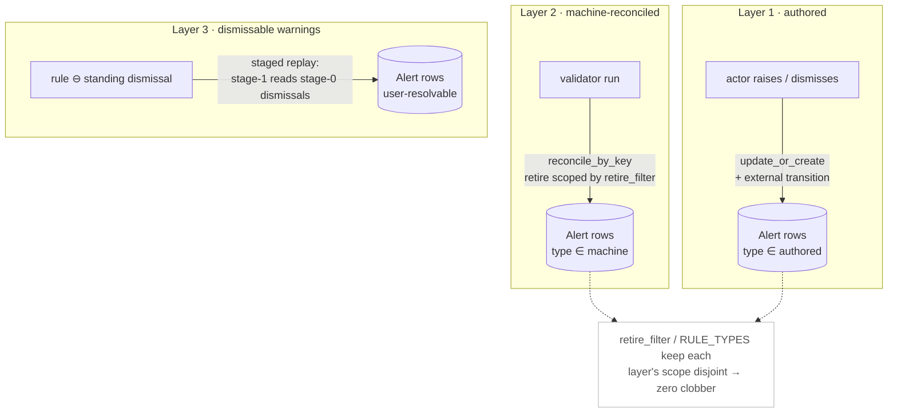

# Alerts as a rakaia projection

**The concept in one picture.** An alert can be raised two ways — a *person*
flags something, or a *rule* fails — and resolved two ways to match. The hard
part is that a re-derivation (replaying the rules) must never clobber a human's
judgment, and a human's dismissal must not be silently re-raised while its rule
still fails. Rakaia handles this by giving each **layer** a different owner and a
different mechanism, scoped so they never touch each other's rows:

The three primitives that make this expressible —
[`reconcile_by_key`](glossary.md#reconcile), `op="retire"` (soft-delete by
`UPDATE` instead of `DELETE`), and `spare_keys` — are introduced in Phase 2
below. The rest of this page is the design and the correctness argument.

---

An **alert** (partisipa's quality `Flag`) is a soft-delete row on an entity:
`(stream_key, alert_type, field_key)` natural key, `severity`/`message`, and a
`resolved_at` that is `NULL` while the alert is open and holds the *resolving
event's timestamp* once retired. Alerts come in three layers, each owned by a
different mechanism. Getting the ownership right is the whole game: a
re-derivation must never clobber a human's judgment, and vice-versa.

| Layer | Owner | rakaia mechanism | Status |
|---|---|---|---|
| **1. Authored / informational** (`alert`, `backfilled`, …) | an actor | appended `alert_raised` / `alert_dismissed` events → natural-key `update_or_create` (+ `external` transition) | **shipped (Phase 1)** |
| **2. Machine-reconciled** (validator violations) | the rules | `reconcile_by_key(..., retire={"resolved_at": ts})`, scoped by `retire_filter` to machine types | **shipped (Phase 2)** |
| **3. Dismissable warnings** (derived ⊕ authored) | rules *and* actor | staged replay: stage-1 reconcile reads stage-0 `alert_dismissed` via the `reader` — authored wins for user-resolvable types | **shipped (Phase 3)** |

## Phase 1 — authored alerts (shipped, zero core changes)

Authored alerts need no new primitive. Raise = upsert the natural key with
`resolved_at=NULL`; dismiss = upsert the same key with `resolved_at=<event ts>`,
`resolved_by=<actor>`. Both are plain, idempotent `Effect(op="update_or_create")`.
The raise/dismiss event each carries its own `Effect(op="external",
kind="alert_transition")`, so **one event = one transition**, and replay drops
all `external` effects — a rebuild never re-spams. This satisfies the "one
transition per real state change, none on replay" rule *by construction*.

Reference: `tests/test_django_rakaia/test_alerts.py::TestAuthoredAlerts` and the
replay-discipline test in `tests/test_rakaia/test_alerts.py`.

## Phase 2 — machine-reconciled alerts (shipped)

Three additions to core made a scoped, soft-delete, natural-key reconcile
expressible (the gaps the flag spike called G1/G2/G3):

- **`reconcile_by_key`** (`rakaia.projections`) — upsert one row per current
  violation keyed by a *composite* natural key merged into `scope`, plus a
  single retire pass over `scope` narrowed by an independent **`retire_filter`**
  (G1), sparing the composite keys still present (G2).
- **`op="retire"`** with a **`patch`** dict (`rakaia.effects`) — soft-delete by
  UPDATE (`resolved_at = <event ts>`) instead of DELETE (G3). The patch value is
  the triggering event's timestamp, never `timezone.now()`, so replay is
  deterministic. `reconcile_by_key` auto-adds an **open-guard**
  (`<field>__isnull=True` for each patch field) so a re-run neither re-stamps an
  already-resolved row nor re-fires a transition.
- **`spare_keys`** on delete/retire (`rakaia.effects` + `DjangoExecutor`) — the
  executor builds `.exclude(Q(**k0) | Q(**k1) | …)` for composite keys.

The headline property (oracle criterion 2, **zero clobber**): because the retire
is scoped by `retire_filter` to machine `alert_type`s, a re-derivation cannot
touch authored rows —
`tests/test_django_rakaia/test_alerts.py::TestMachineReconciledAlerts::test_zero_clobber_authored_untouched`.

`reconcile_children` is left as the positional special case (`key=(index,),
retire="delete"`); it and `reconcile_by_key` share the executor. Unifying the
two is a safe future cleanup, not required.

### Known limitation carried into Phase 3

`reconcile_by_key` emits **no** `external` transition. One retire Effect covers N
rows, and a pure handler cannot see which rows actually flipped, so it cannot
emit "one transition per real machine resolution" without either (a) an
executor-level diff (return the rows a retire actually updated) or (b) the
reader. Until then, machine resolutions are silent; only authored transitions
notify. Phase 3 deferred this to a follow-up (see its "Remaining core gap").

## Phase 3 — composition (derived ⊕ authored), shipped

**Goal.** Open alerts = `reconcile(rule violations)` **⊖** standing dismissals
(user-resolvable only) **⊕** authored raises. A validator warning a human
dismissed must **not** be re-raised while its rule still fails (oracle criterion
3: 27 re-raises → 0), yet a *machine* (non-user-resolvable) type must ignore
dismissals.

**The substrate — already shipped.** The Phase-3 plan originally listed a
cross-stream **refs** capability (#19) as the blocker. That substrate landed on
`main` with the staged-replay work: `ProjectionReader` (`get`/`filter`/`query`),
`register_handler(stage=...)`, and `register_reducer`. A stage > 0 handler is
invoked `fn(event, reader)` and reads projections earlier stages committed;
because the reader only reads committed projections (a pure function of the log),
replay stays deterministic. So **Phase 3 needs no new core primitive** — it is a
staged-handler composition (see `examples/partisipa_staged`).

### How it composes (two stages on the submission stream)

- **Stage 0** — authored `alert_raised` / `alert_dismissed` project `Alert`
  rows. A dismissal records `dismissed_version` (the data version it was made
  against).
- **Stage 1** — the rule reconcile (`reconcile_by_key`) reads the committed
  dismissals via the `reader`. For a **user-resolvable** violating key whose
  standing dismissal holds at `dismissed_version >= the current violation's
  version`, the violation is **omitted from the reconcile `items`** — so it is
  neither re-opened (the row stays resolved) nor retired (`reconcile_by_key`'s
  open-guard protects an already-resolved row). **Machine types ignore
  dismissals** (machine wins). A newer edit (`version > dismissed_version`)
  supersedes the dismissal and re-raises.

`MACHINE_TYPES` = partisipa's `NON_USER_RESOLVABLE_FLAG_TYPES`; user-resolvable
= everything else; `RULE_TYPES` (the reconcile domain / `retire_filter`) is their
union. Authored-only types (`alert`) sit outside `RULE_TYPES`, so the reconcile
never touches them — zero clobber, preserved. Reference + tests:
`tests/test_django_rakaia/test_alerts.py::TestComposedAlerts`.

### Remaining core gap (follow-up, optional)

`reconcile_by_key` emits **no** `external` transition — one retire Effect covers
N rows and a pure handler cannot see which rows actually flipped. Accurate "one
transition per real machine resolution" needs the executor to **return the rows a
retire actually updated** so the orchestrator can emit transitions. Authored
transitions already fire correctly (Phase 1). Tracked separately; not required
for composition correctness.

### Acceptance — the spike oracle

Run `spike/rebuild_ida_status/flag_reconcile_spike.py` over the same population;
a rakaia projection must hit:

1. **Machine parity** — projected open machine alerts == a fresh `run_validators`
   reconcile (baseline 93.6% in_sync; the delta is point-in-time drift the
   projection *removes*).
2. **Zero clobber** — authored alerts untouched (baseline 2027 at risk → 0).
   *Provable from Phase 2; preserved by Phase 3's `RULE_TYPES` retire scope.*
3. **Dismissals honored** — dismissed user-warnings not re-raised while failing
   (baseline 27 → 0). *Phase 3 (`TestComposedAlerts`).*
4. **External discipline** — one `alert_transition` per real state change, none
   on replay. *Authored: Phases 1 & 3. Machine resolutions: the follow-up gap
   above.*

### Open questions

- **Stream-keying (#22):** authored `alert_raised` / `alert_dismissed` on the
  **Submission** stream (recommended — replays in lockstep) vs. a dedicated
  alerts stream.
- **Attachment entity:** rakaia core stays entity-agnostic (`stream_key`); the
  concrete `Alert` model + `MACHINE_ALERT_TYPES` live in the consuming app
  (partisipa) / the example, not core.
