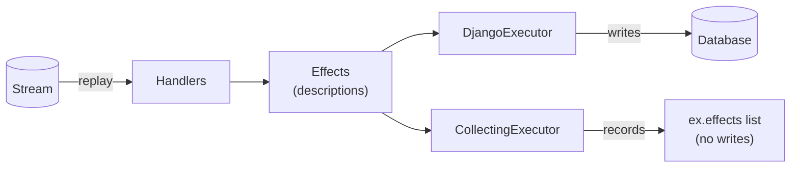

# Dry-run & executors

Handlers in rakaia never touch the database directly. A handler is a pure
function that returns [`Effect`](versioned-handlers.md) descriptions, and an
**executor** decides what to do with them. That split is what makes a dry run a
first-class feature instead of a bolt-on: swap the executor and the same replay
either *writes* or merely *records* what it would write.

## The `Executor` protocol

An executor is any object with an `apply(effects)` method:

```python
class Executor(Protocol):
    def apply(self, effects: Iterable[Effect]) -> ApplyReport | None: ...
```

The same replay produces the same effects either way — the executor is the only
thing that differs, so a dry run is a faithful preview of the real write:



`replay()` calls `apply()` with each batch of effects a handler produces. Rakaia
ships three implementations:

| Executor | Package | What it does |
|---|---|---|
| `DjangoExecutor` | `django_rakaia.effect_executor` | Applies effects for real — an `Upsert` via `update_or_create`, an `Update`, a `Delete`, a `Retire`. |
| `CollectingExecutor` | `rakaia.executors` | Records effects into `.effects` **without applying them**. The building block for a dry run. |
| `InMemoryProjections` | `rakaia.executors` | Applies effects to in-memory dicts, and reads them back — an `Executor` and a `ProjectionReader` in one, with no database. |

You can write your own — anything that satisfies the protocol works (e.g. an
executor that streams effects to a log, or applies them to a non-Django store).

### Applying effects without a database

`InMemoryProjections` is the no-Django applying executor: it upserts, updates,
deletes and retires into dict-backed tables, mints a synthetic primary key per
row so `Ref` resolves as it does on Django, and serves the same rows back
through `get`/`filter`/`query`. It is what lets a test or an example exercise
the whole surface — `Ref`/`RefResolver`, the `reconcile_*` helpers, staged
replay where stage 1 reads what stage 0 committed — in memory:

```python
from rakaia import InMemoryProjections, replay

proj = InMemoryProjections()
replay(store, "submissions", proj, reader=proj)
proj.get("app.Balance", suku="A").total
```

Because it is what the demos and tests rehearse on, "it worked in memory" has to
mean something on Django. Two shared conformance suites enforce that:
`tests/executor_contract.py` holds `InMemoryProjections` and `DjangoExecutor` to the
same batch semantics (writes, then deletes, then retires; one `RefResolver` per
`apply()`; collision detection before the first write), and
`tests/projection_reader_contract.py` does the same for its reader half against
`DjangoProjectionReader` and `PreloadedProjectionReader`.

It is deliberately not an ORM: exact match, `__in` and `__isnull` are the only
lookups it understands, and there are no relations, constraints or transactions.

### Skipping no-op writes

By default `DjangoExecutor` mirrors Django's `update_or_create` — every upsert
issues an `UPDATE`, so re-materialising a large collection where one row changed
rewrites *every* row, churning `auto_now` columns, `post_save` signals, and
replication. Pass `skip_unchanged=True` to fetch the row, compare the effect's
`defaults` to the stored values, and write only the changed columns (or nothing
when nothing changed):

```python
from django_rakaia import DjangoExecutor

replay(store, "orders", DjangoExecutor(skip_unchanged=True))
```

It trades one `UPDATE` per row for one `SELECT` per row, so it pays off when
re-materialising wide or large collections that mostly haven't changed.

## Dry-run replay with `CollectingExecutor`

To preview a replay without side effects, run it with a `CollectingExecutor` and
inspect `.effects`:

```python
from rakaia import CollectingExecutor
from rakaia import replay

ex = CollectingExecutor()
replay(store, "orders", ex)          # zero writes

print(f"{len(ex.effects)} effects would be applied")
for effect in ex.effects:
    print(type(effect).__name__, effect.model_label, effect.lookup)
```

Because handlers are pure, the effects a `CollectingExecutor` records are exactly
the ones a `DjangoExecutor` would apply for the same stream and registry — so the
dry-run count matches the real `effects_applied`. This is the primitive behind:

- **Migration verification** — replay a stream with a `CollectingExecutor`, diff
  the recorded effects against the rows you already have, and confirm a
  cut-over reproduces current state before you commit to it.
- **"What will this replay do?"** — see the writes a `--from/--to` window would
  make before running it for real.

## Make "no writes" enforced rather than assumed

A `CollectingExecutor` writes nothing *because it has no code that writes*. That
is a property of the executor, not a guarantee about the run: a handler that
reaches around it and touches the ORM directly would still write, and the dry run
would still look clean.

Two guards in `django_rakaia` turn the assumption into a check.

**`deny_database_access(*aliases)`** blocks the connection outright. Any query on
a named alias — read or write — raises `AmbientDatabaseAccess`:

```python
from django_rakaia import deny_database_access

with deny_database_access("default"):
    replay(store, "orders", CollectingExecutor())   # a stray query now raises
```

**`assert_no_live_writes(*models, using="default")`** is the narrower one: it
watches specific tables and raises `LiveWriteLeaked` if a row was written while
the block was open.

```python
from django_rakaia import assert_no_live_writes
from orders.models import OrderSummary

with assert_no_live_writes(OrderSummary):
    replay(store, "orders", CollectingExecutor())
```

!!! warning "The two guards differ in kind"

    `deny_database_access` **prevents** the query — nothing reaches the database.
    `assert_no_live_writes` **detects** afterwards, so outside a transaction the
    offending row has already landed by the time it raises. Use it inside
    `transaction.atomic()` if you need the write undone as well as reported, and
    prefer `deny_database_access` when you want prevention.

    Both install themselves on the calling thread's connection, and Django keeps
    one connection per thread. `assert_no_live_writes` is unaffected — it
    compares row counts, so it sees a write from any thread. `deny_database_access`
    would miss one, so the durable store carries the guard across the one thread
    hop it makes (`run_sync`); a write issued on a thread rakaia does not control
    is still not caught. See [ADR 0003](adr/0003-handler-hermeticity.md).

### A rebuild that changes nothing is not a pass

When you diff a rehearsal against existing rows, the result is one of three
verdicts, not two: `GREEN` (compared, and matched), `RED` (compared, and
differed), or `VACUOUS` — *nothing was compared at all*.

`VACUOUS` exists because a run over an empty population passes every assertion
you can write about it, and that is the most common way a verification quietly
certifies nothing. `DiffReport.certified` is true only for `GREEN`, and
`raise_if_diff()` refuses a zero population with `VacuousVerification` unless you
pass `allow_empty`.

## From the command line

The bundled `manage.py replay` command wires this up for you: `--dry-run` swaps in
a `CollectingExecutor`, prints the effect count, and lists each effect it *would*
apply.

```bash
python manage.py replay orders --dry-run
```

```
[DRY RUN] stream='orders' events=6 effects=10 external=4
  upsert orders.OrderSummary {'order_id': 'ORD-1001'}
  upsert orders.OrderSummary {'order_id': 'ORD-1002'}
  ...
```

Drop `--dry-run` to apply the same effects via the `DjangoExecutor`. See
[Versioned handlers](versioned-handlers.md) for the full command reference
(`--from`, `--to`, `--strict-drift`).

## Verifying a from-scratch rebuild: one call

```python
from django_rakaia import rebuild_and_verify

report = rebuild_and_verify(
    "submissions",
    into="rebuild",                            # a disposable alias
    live_models=[Submission, ProjectLink],     # what you expect rebuilt
    registry=reg,
)
report.raise_if_diff()
```

That is the whole gate. It replays the log into the scratch alias, holds both
guards over the run, and diffs the effects against your live rows. Read
`report.verdict`, not `report.ok`: a replay that produced no effects compared
nothing, and "nothing disagreed" is vacuously true for it.

Two things it refuses rather than lets past:

- **`GuardNotArmed`** — it trips the read guard on purpose before replaying, and
  objects if nothing happens. A pass obtained with the guard off looks identical
  to a real one from the outside, which is why this is a raise and not a warning.
- **`ScratchAliasNotEmpty`** — the scratch alias still holds rows from an earlier
  run. A stage > 0 handler would read those as if the log had produced them, and
  the diff (which compares against *production*) would never notice. Nothing is
  deleted for you; truncating a database on the strength of a keyword argument is
  the more dangerous of the two options.

`live_models` is required, and deliberately has no default: an empty one disarms
the write guard, and doing that silently is the exact failure the gate exists to
prevent. Pass `()` if you really mean it.

The rest of this section is what that call does, and when to assemble it
yourself instead.

### The `using=` seam

A `CollectingExecutor` answers a **regression** question: *"does replaying the log
reproduce the rows I already have?"* It writes nothing, so it leans on the target
rows already existing. It cannot answer the **rebuild** question — *"can I build
the whole projection from the log into an empty schema, correctly?"* — because a
stage-1 handler that resolves a reference another form created would find nothing
(the reference was recorded, never applied), so the link can't be verified.

The honest answer is not a bespoke in-memory shadow that imitates the ORM, but the
**real** store, executor and reader pointed at a **disposable database**. All
three — `DjangoStreamStore`, `DjangoExecutor` and `DjangoProjectionReader` — take
a `using=` database alias:

```python
# settings: a throwaway alias — in-memory sqlite for fast/CI proofs,
# or a scratch Postgres for a full-fidelity cut-over rehearsal.
DATABASES["rebuild"] = {"ENGINE": "django.db.backends.sqlite3", "NAME": ":memory:"}

replay(
    DjangoStreamStore(using="rebuild"), "submissions",  # the log comes from there too
    DjangoExecutor(using="rebuild"),                 # writes land in the scratch DB
    reader=DjangoProjectionReader(using="rebuild"),  # stage-1 reads them back
    handler_registry=reg,
)
# ...then diff the rebuilt rows against production and throw the scratch DB away.
```

The store joined that list late (#180), and its absence was the whole obstacle in
practice: `deny_database_access("default")` catches *every* statement on the alias
it guards, including the store's own reads, so a rebuild whose log lived on
`default` tripped its own guard.

Note what the example above assumes: **the log is on the scratch alias**, not on
the database being guarded. That holds when the scratch alias is a restored dump
of production, and then there is nothing to work around — point the store at
`using="rebuild"` and the guard has no honest reason to fire.

When the log is on the database you are guarding — the ordinary case — the
messages still have to leave it before the guard goes up, because a hermetic
rebuild must not read the database it is reconstructing. That is a real step, not
a workaround for a missing keyword argument, and it is one of the things
`rebuild_and_verify` does for you: it reads the stream once with the guard down
and replays from those messages, keeping offsets and the whole envelope as the
durable log recorded them. What `using=` on the store removed was the *untested*
part — the six lines every consumer hand-wrote, at a seam that could not be
pointed anywhere else in order to test it.

Because it is the real ORM, you get full fidelity — constraints, defaults, joins,
`__gte` — for free, with no query engine to write and nothing written to
production.

Two caveats worth stating plainly:

- **Diff on natural keys, not pks.** A from-scratch rebuild assigns fresh primary
  keys (and a symbolic `Ref` resolves FKs to *those* pks), so
  correctness is structural — *"the same submission binds to the same Project by
  natural key"* — never *"row 42 → row 42."*
- **sqlite `:memory:` is full *ORM* fidelity, not full *Postgres* fidelity.** Use
  it for fast, CI-able iteration; replay into a throwaway Postgres alias (same
  code, different `using=`) for the final cut-over proof.

## See it run

Both worked examples exercise the dry run before writing:

- [`examples/orders`](../examples/orders/) — `just orders-demo` prints
  *"Dry run: replay would apply 10 effects (no writes yet)"*, then applies them.
- [`examples/formkit_submissions`](../examples/formkit_submissions/) — uses a
  `CollectingExecutor` to prove a rakaia replay reproduces `formkit-ninja`'s
  direct `to_model()` rows, byte-identical, before any write.
