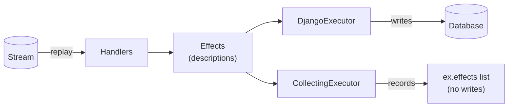

# Dry-run & executors

Handlers in rakaia never touch the database directly. A handler is a pure
function that returns [`Effect`](versioned-handlers.md) descriptions, and an
**executor** decides what to do with them. That split is what makes a dry run a
first-class feature instead of a bolt-on: swap the executor and the same replay
either *writes* or merely *records* what it would write.

## The `Executor` protocol

An executor is any object with an `apply(effects)` method:

```python
class Executor(Protocol):
    def apply(self, effects: Iterable[Effect]) -> None: ...
```

The same replay produces the same effects either way — the executor is the only
thing that differs, so a dry run is a faithful preview of the real write:



`replay()` calls `apply()` with each batch of effects a handler produces. Rakaia
ships two implementations:

| Executor | Package | What it does |
|---|---|---|
| `DjangoExecutor` | `django_rakaia.effect_executor` | Applies effects for real — `update_or_create`, `delete`, and (optionally) external effects. |
| `CollectingExecutor` | `rakaia.executors` | Records effects into `.effects` **without applying them**. The building block for a dry run. |

You can write your own — anything that satisfies the protocol works (e.g. an
executor that streams effects to a log, or applies them to a non-Django store).

### Skipping no-op writes

By default `DjangoExecutor` mirrors Django's `update_or_create` — every upsert
issues an `UPDATE`, so re-materialising a large collection where one row changed
rewrites *every* row, churning `auto_now` columns, `post_save` signals, and
replication. Pass `skip_unchanged=True` to fetch the row, compare the effect's
`defaults` to the stored values, and write only the changed columns (or nothing
when nothing changed):

```python
from django_rakaia.effect_executor import DjangoExecutor

replay(store, "orders", DjangoExecutor(skip_unchanged=True))
```

It trades one `UPDATE` per row for one `SELECT` per row, so it pays off when
re-materialising wide or large collections that mostly haven't changed.

## Dry-run replay with `CollectingExecutor`

To preview a replay without side effects, run it with a `CollectingExecutor` and
inspect `.effects`:

```python
from rakaia.executors import CollectingExecutor
from rakaia.replay import replay

ex = CollectingExecutor()
replay(store, "orders", ex)          # zero writes

print(f"{len(ex.effects)} effects would be applied")
for effect in ex.effects:
    print(effect.op, effect.model_label, effect.lookup)
```

Because handlers are pure, the effects a `CollectingExecutor` records are exactly
the ones a `DjangoExecutor` would apply for the same stream and registry — so the
dry-run count matches the real `effects_applied`. This is the primitive behind:

- **Migration verification** — replay a stream with a `CollectingExecutor`, diff
  the recorded effects against the rows you already have, and confirm a
  cut-over reproduces current state before you commit to it.
- **"What will this replay do?"** — see the writes a `--from/--to` window would
  make before running it for real.

## From the command line

The bundled `manage.py replay` command wires this up for you: `--dry-run` swaps in
a `CollectingExecutor`, prints the effect count, and lists each effect it *would*
apply.

```bash
python manage.py replay orders --dry-run
```

```
[DRY RUN] stream='orders' events=6 effects=10 external_skipped=4
  update_or_create orders.OrderSummary {'order_id': 'ORD-1001'}
  update_or_create orders.OrderSummary {'order_id': 'ORD-1002'}
  ...
```

Drop `--dry-run` to apply the same effects via the `DjangoExecutor`. See
[Versioned handlers](versioned-handlers.md) for the full command reference
(`--from`, `--to`, `--strict-drift`, `--include-external`).

## Verifying a from-scratch rebuild: the `using=` seam

A `CollectingExecutor` answers a **regression** question: *"does replaying the log
reproduce the rows I already have?"* It writes nothing, so it leans on the target
rows already existing. It cannot answer the **rebuild** question — *"can I build
the whole projection from the log into an empty schema, correctly?"* — because a
stage-1 handler that resolves a reference another form created would find nothing
(the reference was recorded, never applied), so the link can't be verified.

The honest answer is not a bespoke in-memory shadow that imitates the ORM, but the
**real** executor and reader pointed at a **disposable database**. Both
`DjangoExecutor` and `DjangoProjectionReader` take a `using=` database alias:

```python
# settings: a throwaway alias — in-memory sqlite for fast/CI proofs,
# or a scratch Postgres for a full-fidelity cut-over rehearsal.
DATABASES["rebuild"] = {"ENGINE": "django.db.backends.sqlite3", "NAME": ":memory:"}

replay(
    store, "submissions",
    DjangoExecutor(using="rebuild"),                 # writes land in the scratch DB
    reader=DjangoProjectionReader(using="rebuild"),  # stage-1 reads them back
    handler_registry=reg,
)
# ...then diff the rebuilt rows against production and throw the scratch DB away.
```

Because it is the real ORM, you get full fidelity — constraints, defaults, joins,
`__gte` — for free, with no query engine to write and nothing written to
production.

Two caveats worth stating plainly:

- **Diff on natural keys, not pks.** A from-scratch rebuild assigns fresh primary
  keys (and a symbolic `Ref` resolves FKs to *those* pks), so
  correctness is structural — *"the same submission binds to the same Project by
  natural key"* — never *"row 42 → row 42."*
- **sqlite `:memory:` is full *ORM* fidelity, not full *Postgres* fidelity.** Use
  it for fast, CI-able iteration; replay into a throwaway Postgres alias (same
  code, different `using=`) for the final cut-over proof.

## See it run

Both worked examples exercise the dry run before writing:

- [`examples/orders`](../examples/orders/) — `just orders-demo` prints
  *"Dry run: replay would apply 10 effects (no writes yet)"*, then applies them.
- [`examples/formkit_submissions`](../examples/formkit_submissions/) — uses a
  `CollectingExecutor` to prove a rakaia replay reproduces `formkit-ninja`'s
  direct `to_model()` rows, byte-identical, before any write.
