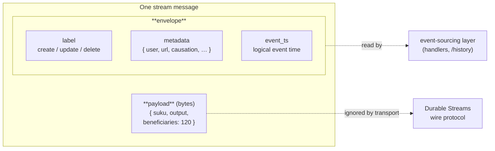
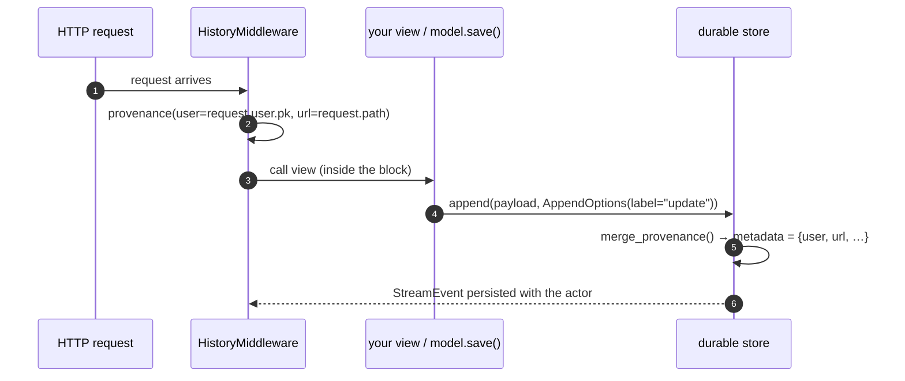
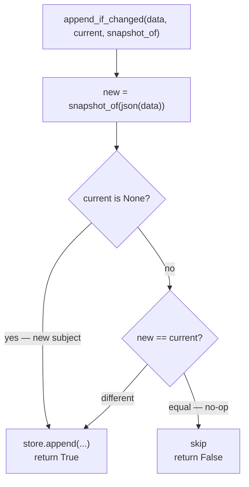

# The event envelope & provenance

A stream event is not just its payload. Alongside the JSON body, every appended
message can carry an **envelope**: a change **label**, an open **metadata** dict,
and a logical **timestamp**. The envelope is where the *audit* facts live —
**who** made the change, **when**, from **what** request, and **what kind** of
change it was — without polluting the payload with them.

This page covers the append-path concepts that build on the envelope:

- the **label + metadata + timestamp** an event carries,
- **`provenance()`** — how the acting user (and any context) is attached, and
- **`append_if_changed`** — recording an event only when something actually
  changed.

Together they are the write-side half of the [history read-model](history-read-model.md).

## Payload vs envelope

The payload answers *what the thing became*. The envelope answers *who/when/how*.
Keeping them separate means the transport ignores the envelope entirely (it's
pure protocol), while the event-sourcing layer reads it to build audit trails.



An event is appended with an `AppendOptions` carrying the envelope:

```python
from rakaia import AppendOptions

store.append(
    "submissions/tf",
    data,                                   # the JSON payload bytes
    AppendOptions(label="update", metadata={"user": 42, "url": "/forms/tf/9"}),
)
```

On the durable store, the envelope is persisted on the `StreamEvent` row:
`event_type` doubles as the **label**, a `metadata` JSON column holds the rest,
and an `event_ts` column holds the logical timestamp. A pure-protocol append (no
envelope) simply leaves `metadata` empty and `event_ts` null.

## The envelope timestamp

There are **two** timestamps on a message, and keeping them straight matters for
deterministic replay:

| Field | Set by | Means |
|---|---|---|
| `StreamMessage.timestamp` | the **store**, at append | *transport* time — when the bytes were written (`time.time()`) |
| `StreamMessage.event_ts` | the **producer** (or defaults to append time) | *logical* event time — when the change actually happened |

The distinction earns its keep during a **backfill**. Two producers set `event_ts`
to deliberately different logical times:

```python
from rakaia import AppendOptions

# live save → event time ≈ append time (leave event_ts unset; it defaults to now)
store.append("submissions/tf", data, AppendOptions(label="update"))

# one-time backfill → stamp the *original historical* time, not the append time
store.append(
    "submissions/tf", data,
    AppendOptions(label="update", event_ts=original_created_at.timestamp()),
)
```

Because the backfill sets `event_ts` to the historical time while its transport
`timestamp` is ≈`now`, `merge_replay(order_key=ENVELOPE_TS)` replays years of
history in one pass **in the order events happened**, not the order they were
loaded. Ordering on the transport `timestamp` would collapse every backfilled
event to ≈`now` and lose that order — which is why merge never uses it. See
[multi-stream merge](multi-stream-merge.md#two-order-key-sources-pick-the-envelope-not-the-payload).

The same rule applies to any *logical-time* value a handler writes (a soft-retire
`resolved_at`, say): derive it from the triggering event's `event_ts`, not
`now()`, or replay stops being reproducible.

The **label** is the one fact a plain `append(payload)` throws away, and
everything the audit consumers need is derivable from it:

| label | `/history` diff marker | pghistory trigger |
|---|---|---|
| `create` / `insert` | `+` | insert |
| `update` (and raw appends) | `~` | update |
| `delete` | `-` | delete |

→ see [`label_marker`](history-read-model.md#labels-and-actors).

## Provenance — attaching the actor ambiently

You *could* pass `metadata={"user": …}` on every `append` call, but the actor is
usually a property of the **request**, not the call site. `provenance()` is a
context manager that sets **ambient** envelope metadata: every append inside the
block merges it in automatically.

```python
from rakaia import provenance

with provenance(user=request.user.pk, url=request.path):
    obj.save()          # any append this triggers is now attributed to the user
```

Explicit metadata on an individual `AppendOptions` still wins over the ambient
values (`merge_provenance` layers ambient *under* explicit), so a call can always
override a field.

Every append path merges the ambient block — both stores, and `@stream_model`.
That last one was the exception until recently: the decorator wrote its event
rows directly, so its `metadata` was always empty and its `event_ts` always
unset, which meant the middleware built to stamp actor and URL could not reach
the appends most Django consumers actually make. `envelope_actor` then fell back
to the payload's owner foreign key — quietly answering "who owns this" in place
of "who saved this".

In a Django app you rarely call `provenance()` by hand — the shipped
`HistoryMiddleware` opens the block for you around each request, mirroring
`pghistory.middleware.HistoryMiddleware`:



Outside a request (a management command, a bulk import, a migration) there's no
ambient actor, so `metadata['user']` is absent — the history read-model
[falls back](history-read-model.md#labels-and-actors) to the payload's own owner
FK.

## `append_if_changed` — suppress no-op appends

`django-pghistory` only records a history row when the row actually changed
(`WHEN OLD.* IS DISTINCT FROM NEW.*`). A naive `store.append(new_state)` records
an event on **every** save — so a stream-native audit log would diverge from
`pgh_event` on no-op saves, and a bulk-import retry would duplicate rows.

`append_if_changed` closes that gap. It appends only when the new payload differs
from the subject's **current** snapshot — which the caller supplies (it's the
state they're about to overwrite, read from the current-state projection):

```python
from rakaia import append_if_changed, AppendOptions

changed = append_if_changed(
    store, "submissions/tf", data,
    current=SubmissionRecord.objects
        .filter(key=sub).values_list("fields", flat=True).first(),
    snapshot_of=lambda ev: ev["fields"],       # compare just the form fields
    options=AppendOptions(label="update"),
)
# changed is True if it appended, False if the save was a no-op.
```



Two things make it correct where a naive comparison wouldn't be:

- **Compare against the subject, not the stream tail.** Form-family streams
  interleave many subjects, so "did *this* subject change" means comparing to
  *its* current projection row — not the stream's last message (which may belong
  to a different subject).
- **`None` means "new", `{}` does not.** Pass `current=None` for a brand-new
  subject (always appends). A genuine empty state (`current={}`) *can* suppress
  an equally-empty new snapshot, so don't use `{}` to mean "new".

`snapshot_of` lets you ignore volatile fields (a server timestamp) that would
otherwise defeat suppression. Comparison is Python `==` over JSON-native values,
so keep both sides on the same JSON round-trip (a `Decimal`/`datetime` in
`current` never equals a parsed payload, which silently disables suppression).

This is the append-layer analogue of the
[`skip_unchanged` executor](projections-and-fan-out.md#avoiding-no-op-writes-on-large-collections):
one suppresses no-op **appends** (write side), the other suppresses no-op
**projection writes** (replay side).

## Where to go next

- [History read-model](history-read-model.md) — turn the enveloped stream into a
  queryable `/history` audit log and a current-state projection.
- [pghistory retirement (spike)](pghistory-retirement.md) — the parity story the
  envelope was designed to satisfy, proven byte-for-byte against `pgh_event`.
- [Multi-stream merge](multi-stream-merge.md) — the envelope `ts` is the natural
  `order_key` for merging several streams.
