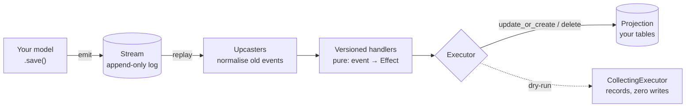

# Examples & concept coverage

This page is the **map of the `examples/` directory**: what each runnable demo
proves, the one command that runs it, and a matrix of which rakaia concept each
one exercises. It's written for two readers:

- **Humans** evaluating or learning rakaia — start at the [mental model](#the-mental-model),
  then run the demo closest to your problem.
- **AI agents / contributors** navigating the repo — jump to the
  [concept → example matrix](#concept-example-coverage-matrix) to find a working
  reference for any public API, and to the [orientation](#orientation-for-contributors)
  for where things live and the conventions every example follows.

Every demo is **assertion-backed**: it prints what it proves and fails loudly if
the behaviour regresses. Running them is the fastest way to confirm the library
works after a change.

!!! note "Machine-readable companion"
    A structured, cross-linked version of this page lives as an
    [Open Knowledge Format](https://github.com/GoogleCloudPlatform/knowledge-catalog)
    bundle at [`okf/`](https://github.com/joshbrooks/rakaia/tree/main/okf) in the
    repo — one concept document per example and per concept group, for agents and
    tools to consume.

## The mental model

Rakaia is two layers, and the examples split along that line.

1. **The protocol layer** — a [Durable Streams](protocol.md) server: an
   append-only, ordered, offset-addressed log (`StreamStore`) with producer
   fencing, close semantics, and subscriber cursors. Zero dependencies, no
   Django. See [`protocol_streams`](#standalone-no-django).
2. **The event-sourcing layer** (`django_rakaia`) — your database tables
   (*projections*) are *derived* from the log by pure,
   [versioned handlers](glossary.md#versioned-handler), so you can
   [replay](glossary.md#replay) history and get time-correct results:



New to the vocabulary (*projection*, *handler*, *upcaster*, *replay*, *effect*)?
The [glossary](glossary.md) defines every term linked above.

## Run everything

```bash
just install     # sync all dependency groups (dev + django + docs + prod)
just demo        # the scripted headless tour, with narration
```

Individual demos are listed in the tables below. Every Django demo migrates
first; the recipe and the command inside it are both idempotent and re-runnable.

## The examples

### Live SSE (Django, browser)

Real-time demos — run the server, open the URL, watch events stream in.

| Example | Proves | Run |
|---|---|---|
| [`chat`](https://github.com/joshbrooks/rakaia/tree/main/examples/chat) | `@stream_model`, multi-stream events per save, live SSE fan-out | `just dev` → `http://localhost:8000` |
| [`polyglot`](https://github.com/joshbrooks/rakaia/tree/main/examples/polyglot) | Language-scoped streams, live-editable translations over SSE | `just polyglot-dev` → `http://localhost:8001` |

### Headless event-sourcing (Django, scripted)

One command each: seed a stream, replay it, assert the projection.

| Example | Proves | Run |
|---|---|---|
| [`orders`](https://github.com/joshbrooks/rakaia/tree/main/examples/orders) | Versioned handlers, `effective_from/to`, upcasters, dry-run, `op="external"`, `op="update"` | `just orders-demo` |
| [`formkit_submissions`](https://github.com/joshbrooks/rakaia/tree/main/examples/formkit_submissions) | Projections/fan-out, `reconcile_children`, migration parity vs a direct `to_model()` | `just formkit-demo` |
| `formkit_submissions` (stream) | Arrow-flip: append log = source of truth → latest-version projection (`project_latest`) | `just formkit-stream-demo` |
| [`projection_cookbook`](https://github.com/joshbrooks/rakaia/tree/main/examples/projection_cookbook) | Staged replay, `ProjectionReader`, `register_simple`, `diff_effects_against_rows` verification | `just cookbook-demo` |
| [`partisipa_history`](https://github.com/joshbrooks/rakaia/tree/main/examples/partisipa_history) | pghistory-parity audit log + `recover_peak_snapshot` from an enveloped stream | `just partisipa-history-demo` |
| [`partisipa_staged`](https://github.com/joshbrooks/rakaia/tree/main/examples/partisipa_staged) | Staged replay resolving late-arriving cross-form links | `just partisipa-demo` |
| [`partisipa_close`](https://github.com/joshbrooks/rakaia/tree/main/examples/partisipa_close) | Close-precondition state machine decided purely from projected state; stage reducers | `just partisipa-close-demo` |
| [`partisipa_merge`](https://github.com/joshbrooks/rakaia/tree/main/examples/partisipa_merge) | `merge_replay` of N streams into one deterministic order; cross-stream rollup | `just partisipa-merge-demo` |
| [`partisipa_repeaters`](https://github.com/joshbrooks/rakaia/tree/main/examples/partisipa_repeaters) | Nested-repeater tree reconcile — no deep orphans, no double-count | `just partisipa-tree-demo` |

### Standalone (no Django)

Zero-dependency scripts — no database, no server. These cover the half of rakaia
that isn't Django at all.

| Example | Proves | Run |
|---|---|---|
| [`protocol_streams`](https://github.com/joshbrooks/rakaia/tree/main/examples/protocol_streams) | `StreamStore` append/read, `append_if_changed`, producer fencing, `close`, `poll` subscriber cursors, CDN cursors | `just protocol-demo` |
| [`multi_owner`](https://github.com/joshbrooks/rakaia/tree/main/examples/multi_owner) | `Ref`/`RefResolver`, `reconcile_aggregate(owns=)`, `reconcile_by_key(retire=)`, `check_disjoint_defaults`, `dispatch_external` | `just multi-owner-demo` |

## Concept → example coverage matrix

Which example to read for a working reference to each public API. `—` means no
example exercises it yet (see [known gaps](#known-gaps)).

### Protocol layer

| Concept | Demonstrated by |
|---|---|
| `StreamStore` append / read / offsets | `protocol_streams`, and every Django demo indirectly |
| `append_if_changed` / `snapshots_equal` (no-op suppression) | `protocol_streams` |
| Producer fencing (`ProducerAccepted`/`Duplicate`/`SequenceGap`/`StaleEpoch`/`InvalidEpochSeq`) | `protocol_streams` |
| Stream `close_stream` / `CloseResult` | `protocol_streams` |
| Subscriber cursors — `poll`, `Poll`, `PollStatus` | `protocol_streams` |
| CDN cursors — `calculate_cursor`, `generate_response_cursor`, `CursorOptions` | `protocol_streams` |

### Event envelope & provenance

| Concept | Demonstrated by |
|---|---|
| `AppendOptions(label=…, metadata=…)`, `provenance()` | `formkit_submissions`, `formkit_submissions` (stream) |
| History read-model — `history_effects`, materialized audit rows | `formkit_submissions`, `partisipa_history` |
| `recover_peak_snapshot` (blank-save recovery) | `partisipa_history` |

### Versioned handlers, upcasters, replay

| Concept | Demonstrated by |
|---|---|
| `register_handler`, `effective_from`/`effective_to` (time-correctness) | `orders`, `formkit_submissions` |
| `register_simple`, `match_field` routing | `projection_cookbook` |
| Upcasters — `register_upcaster` (schema evolution) | `orders`, `formkit_submissions` |
| Drift detection — `on_drift="raise"` | `orders` |
| `replay`, single-stage | most Django demos |
| Staged replay (`stage=`) + `ProjectionReader` | `projection_cookbook`, `partisipa_staged`, `partisipa_close`, `partisipa_merge` |
| `merge_replay` (multi-stream deterministic order) | `partisipa_merge` |
| Stage reducers (via `{"reduce": […]}` stage config) | `partisipa_close`, `partisipa_merge` |

### Effects & executors

| Concept | Demonstrated by |
|---|---|
| `Effect` ops: `update_or_create`, `update`, `delete`+`exclude`, `external` | `orders`, `partisipa_repeaters`, `multi_owner` |
| `CollectingExecutor` (dry-run) | `orders`, `projection_cookbook` |
| `DjangoExecutor` | every Django demo |
| `Ref` / `RefResolver` (bind FK to a sibling's generated key) | `multi_owner` |
| `check_disjoint_defaults` (multi-owner guard) | `multi_owner` |
| `dispatch_external` (route `op="external"`) | `multi_owner` |
| `diff_effects_against_rows` (replay-vs-rows verification) | `projection_cookbook` |

### Projections & fan-out

| Concept | Demonstrated by |
|---|---|
| `reconcile_children` (positional fan-out, orphan-safe) | `formkit_submissions`, `partisipa_close`, `partisipa_repeaters` |
| `project_latest` (subject → latest snapshot) | `formkit_submissions` (stream) |
| `reconcile_aggregate` (grouped rollup) + multi-owner `owns=` | `multi_owner` |
| `reconcile_by_key` (composite natural key) + soft-delete `retire=` | `multi_owner` |

### Django integration

| Concept | Demonstrated by |
|---|---|
| `@stream_model`, `create_stream_event`, multi-stream events | `chat`, `polyglot` |
| Live SSE broadcast (Channels) | `chat`, `polyglot` |
| Durable `DjangoStreamStore` (log persisted in the DB) | `formkit_submissions` (stream) |

### Known gaps

No example exercises these yet — a good place to contribute a demo:

- `register_reducer` as the *public API* (the partisipa demos wire reducers via
  raw `{"reduce": […]}` stage config instead).
- `reconcile_tree` (the `partisipa_repeaters` spike hand-rolls the equivalent
  with `delete`+`exclude`).
- `replay_stream` (the Django convenience wrapper).
- `DjangoExecutor(skip_unchanged=True)`.

## Orientation for contributors

**Anatomy of an example.** A Django example (`examples/<name>/`) is a minimal
Django project:

- `<name>_project/settings.py` — `INSTALLED_APPS` includes `django_rakaia` and
  the example app; `RAKAIA_STORE` selects the in-memory or durable store.
- `<app>/models.py` — the projection tables (the *derived* state).
- `<app>/handlers.py` — the pure `event → Effect` handlers, registered with
  `@register_handler` / `@register_simple` / `@register_reducer`.
- `<app>/seed.py` — the sample events the demo replays.
- `<app>/management/commands/demo_<name>.py` — the runnable walkthrough.

A standalone example (`examples/protocol_streams/`, `examples/multi_owner/`) is
just a `demo.py` script that imports `rakaia` and the stdlib — no Django, no DB.

**Conventions every example follows:**

- **Migrate-first.** Each `demo_*` management command calls `migrate` itself, so
  it works run directly *or* via `just`. The `db.sqlite3` files are gitignored
  scratch state — never a committed fixture.
- **Assertion-backed.** A demo ends with `All … checks passed ✓` or a traceback;
  there is no "looks right" path. Re-running is idempotent (many take `--twice`).
- **Deterministic.** Replays produce the same projection every time — no
  `timezone.now()` inside a handler; event timestamps come from the envelope.

**Adding an example:** copy the closest existing project, add a `just <name>-demo`
recipe (migrate-first), a `README.md`, and — if it demonstrates a headline
feature — a row in the [what's-new tour](whats-new.md) and this page's matrix.

Run `just install && just demo` before pushing; CI runs `ruff check`,
`ruff format --check`, `pytest`, and `zensical build`.
