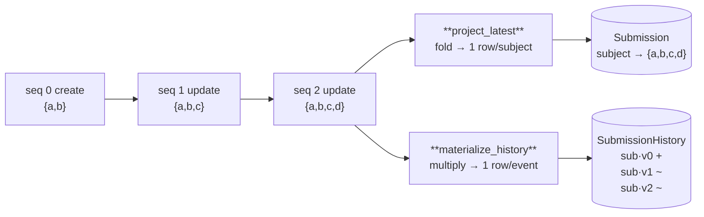
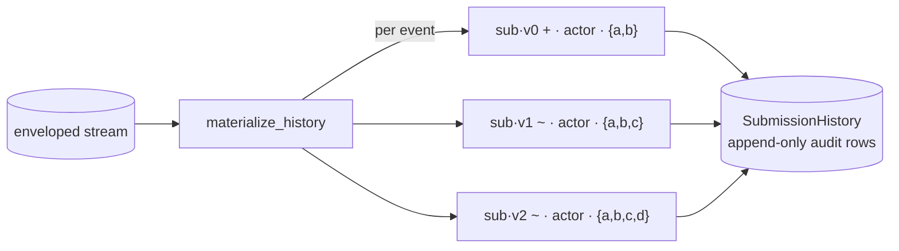
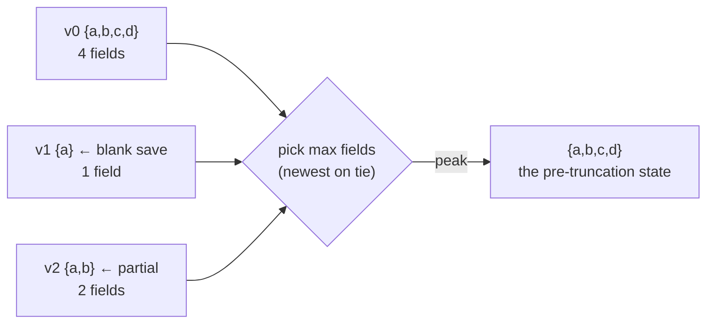

# The history read-model

Once a stream carries an [envelope](event-envelope.md) on every event, you can
derive **two different tables** from the same log — and the choice between them
is the whole idea on this page:

- a **latest-state** projection — one row per subject, "what is it *now*"; and
- a **history** read-model — one row per *event*, "what *changed*, when, by whom".

Both are ordinary [projections](glossary.md#projection) — pure functions of the
log. The history read-model is the streams-native replacement for
`django-pghistory`: the `/history` audit API, the admin event log, and blank-save
recovery, all rebuilt by replay.

## Fold vs multiply

A latest-state projection **folds** the stream — later events overwrite the same
row (last-write-wins). A history read-model **multiplies** it — every event
becomes its own immutable row, keyed by `(subject, version)`, so nothing is ever
overwritten. Same log, opposite shapes:



| | `project_latest` | `materialize_history` |
|---|---|---|
| rows per subject | **1** (latest) | **N** (one per event) |
| key | `subject` | `(subject, version)` |
| answers | "what is it now?" | "what changed, when, by whom?" |
| on new event | overwrites the row | appends a new row |
| replaces | the `Submission` table | pghistory's `pgh_event` |

Both are idempotent, and both are safe on an incremental tail read — absence of a
subject from a message slice never deletes anything (only an explicit
[tombstone](#latest-state-project_latest) does).

## Latest-state: `project_latest`

`project_latest` folds a message slice to the newest event per subject and emits
one `update_or_create` per live subject — plus a `delete` for any subject whose
latest event is a **tombstone** (a delete-style label):

```python
from rakaia import project_latest

effects = project_latest(
    messages,
    model_label="submissions.Submission",
    subject_of=lambda ev: ev["submission_id"],
    defaults_of=lambda msg, ev: {
        "fields": ev["fields"],
        "actor_id": msg.metadata.get("user"),
        "updated_at": msg.timestamp,
    },
    tombstone_labels=("delete", "cancel"),  # default: ("delete",)
)
```

This is the everyday current-state read-model — reach for it whenever you only
care about the subject's present value.

## History: `materialize_history`

`materialize_history` reads the whole stream and writes **one audit row per
event**, keyed by `(subject, version)` so re-materialising is a no-op. You shape
the row with a `defaults_of(msg, event)` callback, so the audit model can match
whatever `/history` returns:

```python
from django_rakaia import materialize_history
from rakaia import label_marker, envelope_actor

materialize_history(
    store,
    "submissions",
    "audit.SubmissionHistory",
    subject_of=lambda ev: ev["submission_id"],
    defaults_of=lambda msg, ev: {
        "marker": label_marker(msg.label),  # + / ~ / -
        "actor_id": envelope_actor(msg, ev),  # who edited it
        "ts": msg.timestamp,
        "snapshot": ev["fields"],  # the full snapshot
    },
    version_of=lambda m: int(m.offset),  # stable, never-renumbered key
)
```



!!! warning "Version the audit rows by a stable key"
    The default `version` is the event's **index** in `messages`, which is only
    correct when `messages` is the *whole* stream. For an incremental tail read
    or a [merged](multi-stream-merge.md) input — where the index restarts and
    would collide with earlier events of the same subject — pass `version_of` to
    derive a stable per-event version. The durable store's `offset` is a
    monotonic integer, so `version_of=lambda m: int(m.offset)` is the
    recommended key ("audit keyed by `(stream, offset)`, never renumbered").

`materialize_history` is the convenience endpoint over `history_effects`, which
just builds the Effects (read → build → apply, in one call). Drop to
`history_effects` when you want to preview or batch the writes yourself.

## Labels and actors

Two small helpers cover the fiddly bits the audit consumers need:

- **`label_marker(label)`** maps an envelope label to the `/history` diff marker:
  `insert`/`create` → `+`, `delete` → `-`, everything else (incl. `update` and
  the empty raw-append label) → `~` — matching pghistory's `_label_to_type`.
- **`envelope_actor(msg, event)`** resolves the acting user: the envelope's
  `metadata['user']` (the editor set by [`provenance()`](event-envelope.md#provenance-attaching-the-actor-ambiently)),
  falling back to the payload's own owner FK when there's no request-context
  actor (a bulk import, a management command, a migration).

## Recovering the peak snapshot

The **peak snapshot** is a subject's most complete historical snapshot — the one
with the most fields. Recovering it is Partisipa's `repair_blank_save_dataloss`
in stream form: a subject corrupted by a legacy *blank/truncating save* is
restored from the pre-truncation snapshot, which never left the log.

rakaia ships no helper for this — once the audit rows exist, recovery is a
one-line scan over them, and each application's idea of "the snapshot" differs
enough that a shared signature earns nothing:

```python
rows = SubmissionHistoryEntry.objects.filter(submission_id="sub-water-01")
recovered = max((r.fields for r in rows), key=len, default={})
```



On a tie (equal field counts) the **newest** snapshot wins — recovery restores
the latest good state, not the earliest. It's a **legacy-only** move: it recovers
from a bug, and with [`append_if_changed`](event-envelope.md#append_if_changed-suppress-no-op-appends)
suppressing no-op writes, stream-native writes needn't produce blank snapshots at
all. Reach for it to heal old pghistory data, not as an ongoing need. The
[`partisipa_history`](../examples/partisipa_history/) example runs it against
both a stream-derived audit log and pghistory, and asserts they agree.

## Where to go next

- [The event envelope & provenance](event-envelope.md) — the write side: how each
  event gets its label and actor in the first place.
- [pghistory retirement (spike)](pghistory-retirement.md) — the full parity story
  and migration path, proven byte-for-byte against `pgh_event`.
- The [`formkit_submissions`](../examples/formkit_submissions/) example runs a
  streams-native `/history` end-to-end.
