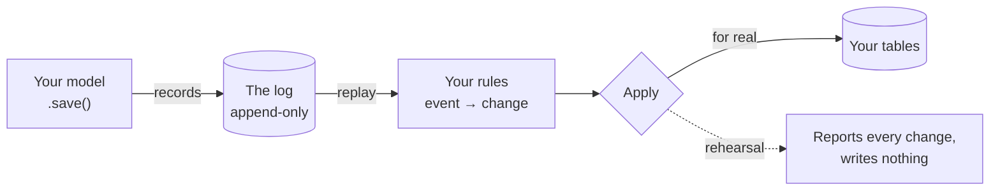

# Rakaia

**Build your Django tables from a record of what happened, so you can rebuild
them when the code was wrong.**

Most projects write to a table and keep a change log beside it. Rakaia turns that
around: the log is the original, and your tables are produced by reading it back.
When you find a bug in how a table was filled in, you fix the code and re-run —
no repair script, no guessing what the row should have been.

It also lets you *rehearse* that rebuild against real data and see exactly what it
would write, without writing anything.

!!! tip "Start here"

    - **[Tutorial](tutorial.md)** — ten minutes from nothing to a table you
      rebuild after fixing a bug in it.
    - **[Why Rakaia exists](why-rakaia.md)** — what this buys you, what it costs
      you, and when to use something simpler.
    - **[Glossary](glossary.md)** — every term used here, in plain language.
    - **[API reference](api-reference.md)** — all 131 exported names.

## Install

```bash
pip install "rakaia-streams[django]"
```

The distribution is `rakaia-streams`; you import `rakaia` and `django_rakaia`.

## What you get



Two packages, either usable on its own:

- **`django_rakaia`** — the part most people want. Records changes to your Django
  models, rebuilds tables from those records, and can rehearse a rebuild without
  touching the database.
- **`rakaia`** — a standalone server speaking the
  [Durable Streams protocol](protocol.md), with no dependencies at all. Run it
  with `uvicorn`, or mount it inside Django, FastAPI, or Starlette.

## Try it without installing anything

Four sample Django projects, each proving one thing. They assert their own claims
and fail loudly if the library stops delivering, so they double as tests:

| Example | Shows | Run |
|---|---|---|
| [`partisipa_history`](../examples/partisipa_history/) | Reproducing an audit log exactly, and recovering a truncated record | `just partisipa-history-demo` |
| [`orders`](../examples/orders/) | Rules that changed over time, replayed correctly | `just orders-demo` |
| [`formkit_submissions`](../examples/formkit_submissions/) | One change updating many rows without orphans | `just formkit-demo` |
| [`chat`](../examples/chat/) | Recording changes on `save()`, live updates over SSE | `just dev` |

## Where to go next

- **New here?** [The tutorial](tutorial.md), then
  [why Rakaia exists](why-rakaia.md).
- **Evaluating it?** [Why Rakaia exists](why-rakaia.md) is written for you and is
  honest about the limits. Then [the public API](public-api.md) for what is and
  isn't promised before 1.0.
- **Already using it?** [What's new](whats-new.md) tours recent features, each
  with a command that demonstrates it.

!!! warning "Pre-1.0"

    Pin an upper bound — `rakaia-streams>=0.2,<0.3`. See
    [the public API](public-api.md) for which names are stable and which are not.
