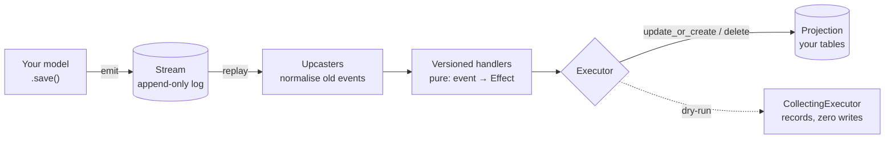

# Rakaia Documentation

**Rakaia** is a Python implementation of the [Durable Streams protocol](protocol.md) — an
HTTP-based protocol for append-only, ordered, durable byte streams.

The project ships two installable packages:

- **`rakaia`** — A zero-dependency ASGI application implementing the protocol. Run
  it standalone with `uvicorn`/`daphne`/`granian`, or mount it inside Django,
  FastAPI, or Starlette.
- **`django_rakaia`** — A Django app that stores stream events in your database
  via normalized `Stream` / `StreamEvent` / `StreamEntry` models, broadcasts
  changes over Django Channels, and provides a `@stream_model` decorator for
  emitting events from your own Django models.

!!! tip "New here?"
    Start with the **[guided tour of what's new](whats-new.md)** — every recent
    feature with a one-command demo you can run to prove it. New to the
    vocabulary (*projection*, *handler*, *upcaster*, *replay*)? See the
    **[glossary](glossary.md)**.

Beyond the raw protocol server, `django_rakaia` derives your database tables from
an append-only log of events — so you can replay history and rebuild them:



## Installation

```bash
# Core protocol server only (zero runtime dependencies)
pip install rakaia

# With the Django integration
pip install "rakaia[django]"

# With Redis-backed channel layer (for multi-process SSE)
pip install "rakaia[django,redis]"
```

## Quick Start (standalone server)

```bash
pip install rakaia uvicorn
uvicorn rakaia:app --port 4437
```

That gives you a fully functional Durable Streams server backed by an
in-memory store.

```python
from rakaia import create_app, StreamStore

# Default in-memory store
app = create_app()

# Or supply your own store
app = create_app(store=StreamStore())
```

## Quick Start (Django integration)

See [`django-integration.md`](django-integration.md) for the full guide.

```python
# settings.py
INSTALLED_APPS = [
    "daphne",
    "channels",
    "django_rakaia",
    # ...
]
ASGI_APPLICATION = "myproject.asgi.application"
CHANNEL_LAYERS = {
    "default": {"BACKEND": "channels.layers.InMemoryChannelLayer"},
}
```

```python
# models.py
from dataclasses import dataclass
from django.db import models
from django_rakaia.decorators import stream_model

@dataclass
class RoomData:
    id: int
    name: str

@stream_model(
    stream_paths=lambda obj: f"room:{obj.id}:messages",
    to_dataclass=lambda obj: RoomData(id=obj.id, name=obj.name),
)
class ChatRoom(models.Model):
    name = models.CharField(max_length=100)
```

Every save/delete now emits a `StreamEvent` and a `StreamEntry` against the
relevant stream(s), automatically broadcast to any connected SSE consumers via
the channel layer.

## Documentation index

- [What's new — a guided tour](whats-new.md) — recent features, each with a demo.
- [Glossary](glossary.md) — plain-language definitions of the event-sourcing terms.
- [Django integration](django-integration.md) — Models, decorator, admin, SSE,
  and adopting the durable store.
- [Versioned handlers](versioned-handlers.md) — Time-correct replay, handler
  versions, upcasters, drift detection.
- [Projections & fan-out](projections-and-fan-out.md) — One event into many
  rows, orphan-free with `reconcile_children`.
- [The event envelope & provenance](event-envelope.md) — Attach the actor,
  label, and no-op suppression on append.
- [History read-model](history-read-model.md) — Latest-state vs a queryable
  audit trail, both derived from one log.
- [Alerts projection](alerts-projection.md) — Human judgment and machine rules
  in one projection, without clobber.
- [Dry-run & executors](dry-run-and-executors.md) — Preview a replay's writes
  with zero side effects.
- [Translations](translations.md) — Optional `Translatable` model and UI.
- [Deployment](deployment.md) — Production setup, ASGI servers, Redis channel
  layer, scaling.
- [Protocol specification](protocol.md) — Wire format, headers, semantics.
- [Backend storage](streams-backend-storage.md) — Browser-side stream persistence.

## Sample applications

Four standalone Django projects each demonstrate one feature area. Run them all
with `just demo`, or individually:

| Example | Demonstrates | Run |
|---|---|---|
| [`orders`](../examples/orders/) | Versioned handlers, upcasters, replay, dry-run | `just orders-demo` |
| [`formkit_submissions`](../examples/formkit_submissions/) | Projections/fan-out, `reconcile_children`, migration parity | `just formkit-demo` |
| [`chat`](../examples/chat/) | `@stream_model`, multi-stream events, live SSE | `just dev` |
| [`polyglot`](../examples/polyglot/) | Language-scoped streams, live-editable translations | `just polyglot-dev` |

The [guided tour](whats-new.md) narrates what each one proves.
