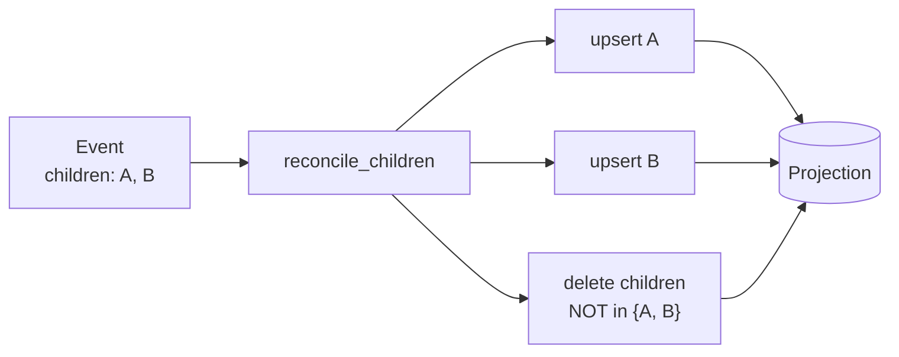

# Projections & fan-out

A handler often needs to turn **one source event into many rows** — a form
submission with a repeater, an order with line items, a survey with answers.
This page covers how to project such collections safely, and the one trap to
avoid: **orphans on shrink**.

## `@stream_model` is not this

It's worth stating plainly, because the names are close. The
[`@stream_model`](django-integration.md) decorator emits **one stream event per
model save** — it turns a Django model's lifecycle into a stream. That is the
*opposite* direction from what this page is about: here we take *one* event and
fan it out into *many* projection rows. Don't reach for `@stream_model` to
decompose a nested payload; write a fan-out handler instead.

## The fan-out handler

A handler may return a **list** of `Effect`s. One update per child row, keyed by
the parent plus the child's index:

```python
from rakaia import Upsert, register_handler

@register_handler(name="activity_rows", event_match="submissions",
                  effective_from=0)
def activity_rows(event: dict) -> list[Upsert]:
    sid = event["submission_id"]
    return [
        Upsert(
            model_label="submissions.ActivityProgress",
            lookup={"submission_id": sid, "activity_index": i},
            defaults={"name": a["name"], "progress_pct": a["progress_pct"]},
        )
        for i, a in enumerate(event["fields"]["activities"])
    ]
```

This is idempotent — replaying converges, because each row is an
`update_or_create` keyed on `(submission_id, activity_index)`.

## The orphan trap

The handler above has a latent bug. Suppose a submission is **corrected** and
re-appended with *fewer* activities than before:

```
seq 3  submission S  -> activities [A, B, C]   # writes indices 0, 1, 2
seq 9  submission S  -> activities [A, B]       # writes indices 0, 1
```

Replaying the whole stream leaves the index-2 row (`C`) alive forever. Nothing
in the fan-out ever deletes it — `update_or_create` only ever writes. Any
collection projection that can shrink hits this.

## `reconcile_children`

`reconcile_children` is the fix: it emits the per-child upserts **and** a single
reconcile `delete` that removes every child under the parent *except* the
indices still present.



```python
from rakaia import register_handler, reconcile_children

@register_handler(name="activity_rows", event_match="submissions",
                  effective_from=0)
def activity_rows(event: dict):
    return reconcile_children(
        model_label="submissions.ActivityProgress",
        parent_lookup={"submission_id": event["submission_id"]},
        child_key="activity_index",
        items=event["fields"]["activities"],
        defaults_fn=lambda a: {"name": a["name"], "progress_pct": a["progress_pct"]},
    )
```

For `items=[A, B]` it returns two `Upsert` effects (indices 0 and 1) followed by:

```python
Delete(
    model_label="submissions.ActivityProgress",
    lookup={"submission_id": sid},
    spare=Exclude({"activity_index__in": [0, 1]}),   # spare the current children
)
```

so the stale index-2 row is pruned. An empty `items` yields just the delete,
which removes every child under the parent.

The `DjangoExecutor` applies **all upserts before any deletes** within one
transaction, so a reconcile batch converges regardless of the order handlers
returned effects in, and the delete never races the writes it's meant to keep.

## Why not a raw `Delete` every time?

You can build the same thing by hand with a `Delete` effect — that's all
`reconcile_children` does. The helper exists so every collection projection gets
the orphan handling for free instead of re-deriving it (and forgetting the
`spare`, which is the whole point). Reach for the raw delete only when the
scope isn't "children of a parent keyed by index".

## Reorderable collections: key by id, not index

`reconcile_children` keys rows by **positional index**, which makes it right for
fixed-order or append-only collections but wrong for **reorderable** ones: a
reorder renumbers every subsequent index, so replay rewrites O(N) rows *and* any
foreign key to a child now points at a different logical item.

For reorderable data, key rows by a **stable id** and store order as a
**fractional index** field. `reconcile_tree` is built for this: it keys each row
by whatever `id_fn` returns and passes your fields straight through
`defaults_fn`. Two things stay *your* responsibility, though — the helper is
order-agnostic and identity-agnostic:

- **the stable id** must come from your data (a business key, or one assigned at
  ingestion). `reconcile_tree` does not make ids stable; if `id_fn` returns
  something position-derived, you're back to the index problem.
- **the order field** is yours to compute (a fractional index is recommended) and
  return from `defaults_fn`; then read with `ORDER BY`. `reconcile_tree` neither
  sorts nodes nor adds an order column.

See [ADR 0001](adr/0001-ordering-child-collections-in-projections.md) for the full
rationale (and why a linked list is the wrong choice for a SQL-backed
projection).

## Avoiding no-op writes on large collections

A reconcile emits one `update_or_create` per current row, and Django's
`update_or_create` always issues an UPDATE. So re-materialising a 100-row
collection where a single value changed rewrites all 100 rows — churning
`auto_now` columns, `post_save` signals, and replication for 99 no-ops.

`DjangoExecutor(skip_unchanged=True)` closes that: it fetches each row, compares
the effect's `defaults` to the stored values, and writes **only the changed
columns** — skipping the UPDATE entirely when nothing changed. A big tree with
one edit, or a reorder that moves one row, then costs one write instead of N.

```python
DjangoExecutor(skip_unchanged=True).apply(effects)
```

It trades one UPDATE per row for one SELECT per row, so reach for it when writes
are the expensive part. It's opt-in because skipping a no-op write is observably
different — an unchanged row's `auto_now` fields don't advance and its
`post_save` signal doesn't fire.

## Multi-owner rows: `Update` (update-if-exists)

Sometimes one projection row is assembled by **several independent reducers**,
each owning a disjoint set of columns — a `ProjectProjection` whose status
columns come from one reducer and whose finance columns come from another. Only
the *primary* owner should create the row; a secondary owner must write its
columns **only if the row already exists**, never mint an empty one.

An `Upsert` can't express that — it always inserts on a miss. The
`Update` effect is the missing primitive: it updates the row(s) matching
`lookup` in place and **never inserts** — a no-op when nothing matches (and a
no-op when `defaults` is empty). So the secondary owner emits its effect
unconditionally, with no read:

```python
# finance reducer — owns only the ksp_* columns of a shared row
Update(
    model_label="ida.ProjectProjection",
    lookup={"project_id": project_id},
    defaults={"ksp_operational": op_total, "ksp_infrastructure": inf_total},
)
```

Before `Update`, that reducer had to hand-roll a guard —
`... and not ProjectProjection.objects.filter(project_id=project_id).exists()` —
to avoid minting an empty row for a project with no status row yet. That read
broke the pure `event → Effect` model and cost a query per group. Update-if-exists
removes it: an absent row is a no-op, and when contributors vanish the same
effect with `defaults={"ksp_operational": None, ...}` clears the columns on the
row that's still there.

The disjoint-defaults invariant still holds across owners: two effects (whether
`Update` or `Upsert`) that write the **same** column on the same row in
one batch raise `EffectCollisionError`, so overlapping ownership surfaces as a
loud error rather than a last-writer-wins race.

### Reconciling a multi-owned aggregate: `reconcile_aggregate(owns=…)`

The write side above is only half the story. `reconcile_aggregate` also emits a
**reconcile pass** that removes rows for groups which lost their last
contributor — and by default that pass is a whole-row `delete`. On a shared row
that delete would clobber the *other* owners' columns when this reducer's group
vanishes. Pass `owns=` (the columns this reducer owns) to switch to the
multi-owner reconcile:

```python
# finance reducer recomputes its ksp_total per suku on a shared SukuProjection row
reconcile_aggregate(
    "ida.SukuProjection",
    scope_lookup={},
    group_key="suku",
    groups={suku: {"ksp_total": total} for suku, total in recomputed.items()},
    owns=["ksp_total"],            # <- multi-owner mode
)
```

With `owns=` set, each group is an `Update` (never mints the row), and a
vanished group's row is **not deleted** — its `ksp_total` is null-cleared via a
`Retire` patch that spares the groups still present, leaving the status
reducer's columns on that row untouched. The null-out needs no liveness guard: a
column set to `None` converges on re-run, so it is idempotent as-is (unlike a
soft-delete `Retire`, which stamps a sentinel and must guard on it).

Under an **incremental, touched-aware** reducer that recomputes only the touched
subjects, bound the reconcile with `retire_filter=` so it does not reap groups
elsewhere that still exist but were not recomputed this pass — it scopes only the
reconcile, not the per-group upserts:

```python
reconcile_aggregate(
    "ida.SukuProjection", scope_lookup={}, group_key="suku",
    groups=recomputed, owns=["ksp_total"],
    retire_filter={"report_id__in": touched_report_ids},
)
```
