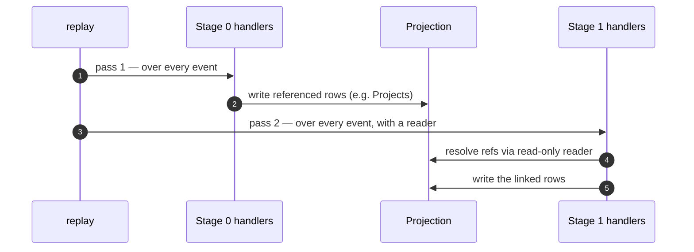

# Staged replay

> Status: **in core** ([issue #7](https://github.com/joshbrooks/rakaia/issues/7)
> feature #1). Prototyped in
> [`examples/partisipa_staged`](../examples/partisipa_staged); the spike's
> `stage=` / `refs` shape now ships in `register_handler` and `replay()`. This
> page is the design; the sections below show the real API.

## Using it

Declare a handler's stage; replay runs stages in ascending order, and a stage > 0
handler is called `fn(event, reader)` with a read-only projection reader:

```python
from rakaia import Upsert, register_handler
from rakaia import replay
from django_rakaia import DjangoExecutor
from django_rakaia import DjangoProjectionReader


@register_handler(
    name="project", event_match="TF_6_1_1", match_field="form_type", stage=0
)
def project(event):  # stage 0: build the reference
    return Upsert(
        model_label="ida.Project",
        lookup={"suku": event["suku"], "output": event["output"]},
        defaults={"name": event["project_name"]},
    )


@register_handler(name="sf12", event_match="SF_1_2", match_field="form_type", stage=1)
def sf12(event, refs):  # stage 1: resolve via the reader
    project = refs.get("ida.Project", suku=event["suku"], output=event["output"])
    return Upsert(
        model_label="ida_forms.Sf_1_2",
        lookup={"submission_id": event["key"]},
        defaults={"project_id": project.pk if project else None},
    )


replay(store, "submissions", DjangoExecutor(), reader=DjangoProjectionReader())
```

`replay()` requires `reader=` whenever any handler declares stage > 0 (or any
reducer is registered, see below); with only stage 0 handlers it is a single pass
and no reader is needed (backward compatible). The reader is any
`rakaia.protocols.ProjectionReader` (`get` / `filter` / `query`); the Django one
reads `apps.get_model(...).objects`.

## Per-stage aggregates: reducers

Some projections aren't per-event — a rollup depends on the *whole set* of
contributing rows, and an increment isn't replay-safe. A **reducer** runs once
per stage, after that stage's per-event handlers commit, reading the accumulated
projections and returning idempotent Effects (typically via
[`reconcile_aggregate`](projections-and-fan-out.md)):

```python
from rakaia import register_reducer
from rakaia import reconcile_aggregate


@register_reducer(name="balance", stage=1)
def balance(reader):  # runs once, after stage-1 handlers
    totals = {}
    for line in reader.query("ida.FinanceLine"):
        totals[line.suku] = totals.get(line.suku, 0) + line.amount
    return reconcile_aggregate(
        "ida.Balance", {}, "suku", {s: {"total": t} for s, t in totals.items()}
    )
```

Because it **recomputes** from the current rows on every replay, re-running is a
no-op on the totals — the double-count bug is gone. `reconcile_aggregate` builds
the effects; the reducer is the replay-time hook that runs it. A registry with
any reducer replays in staged mode and requires `reader=`.

Replay makes one pass per stage; a later stage reads what earlier stages wrote:



## The problem: late-arriving cross-form links

A projection often depends on a fact that lives in a *different* event — and
that event may not have arrived yet. Partisipa is the canonical case: an
`SF_1_2` social form must link to the `ida.Project` for its `(suku, output)`,
but the `TF_6_1_1` form that *defines* that project is frequently submitted
**after** the social and finance forms for the same suku.

A single pass in stream order can't resolve this: when `SF_1_2` is processed,
its project doesn't exist yet, so it links to nothing. Partisipa copes with two
workarounds — a signal (`SeparatedSubmissionProject.save()`) that re-attempts
the link on *every* save, and one-shot backfill tasks
(`_task_sf12_backfill_project_ids`, a ~1600-line `post_migration_tasks.py`) that
sweep and re-link once the `TF_6_1_1` finally lands. Both are symptoms of a
projection that can't see across events.

## The proposal: stages + a read-only `refs` view

Let a handler declare a **stage**. Replay runs stages in order; a handler in
stage *N > 0* receives a read-only `refs` accessor over the projections that
earlier stages materialized.

```python
@register_handler(
    name="project_registry", event_match="TF_6_1_1", match_field="form_type", stage=0
)
def project_registry(event):
    return Upsert(
        model_label="ida.Project",
        lookup={"suku": event["suku"], "output": event["output"]},
        defaults={"name": event["project_name"]},
    )


@register_handler(
    name="sf12_link", event_match="SF_1_2", match_field="form_type", stage=1
)
def sf12_link(event, refs):
    project = refs.get("ida.Project", suku=event["suku"], output=event["output"])
    return Upsert(
        model_label="ida_forms.Sf_1_2",
        lookup={"submission_id": event["key"]},
        defaults={"project_id": project.pk if project else None},
    )
```

Because **stage 0 is applied in full before stage 1 begins**, the entire project
registry exists by the time any `SF_1_2` is linked — regardless of the order the
forms appear in the stream. The late-arrival problem disappears without a single
backfill task.

## Why it stays deterministic

The usual objection to "handlers that read state" is that it breaks replay
determinism. It doesn't here, because `refs` only ever reads **committed
projections that are themselves a pure function of the log**. Given the same
stream, stage 0 produces the same `ida.Project` rows every time, so stage 1 sees
the same `refs` every time. Handlers remain pure with respect to their inputs
`(event, refs)`; the executor is still the only thing that writes.

Two rules keep it honest:

1. **Stages are a DAG, applied in a fixed topological order.** A stage may read
   only from strictly-earlier stages, never its own or a later one.
2. **`refs` is read-only.** It exposes queries over materialized rows, not
   writes. All writes still flow through `Effect`s and the executor.

## Self-healing replaces backfills

Because the link is *derived* on every replay, a late reference event heals
itself. In the spike:

1. `SF_1_2` for `(Liquica, TANK)` arrives; its `TF_6_1_1` hasn't. Replay leaves
   it unlinked (`link_reason="NPO"`).
2. The `TF_6_1_1` for `(Liquica, TANK)` arrives later in the stream.
3. Re-running the staged replay links the `SF_1_2` — **no bespoke backfill
   task**. The projection simply re-derives from the now-complete log.

This is the direct replacement for `SeparatedSubmissionProject` + the
`_task_*_backfill` family.

## What it unlocks

- **#3 (aggregates/rollups):** a rollup stage reads the contributing projection
  through `refs` and recomputes a group total idempotently — the aggregate
  analogue of `reconcile_children`.
- **Close-precondition state machines:** `POM_1`'s "all projects 100%, balances
  ≥ 0" checks become a late stage folding over the project/finance projections.

## Try it

```sh
just partisipa-demo
```

The command runs three asserted checks: **NAIVE** (reproduces the unlinked bug),
**STAGED** (links every form regardless of arrival order), and **SELF-HEAL** (a
late `TF_6_1_1` re-links its `SF_1_2` with no backfill, idempotently).

## Open questions for the core API

- **Where does `refs` read from during a live (non-replay) append?** Options: the
  durable store's projection tables, or a replay-only capability (staged replay
  is a batch/rebuild operation, distinct from per-event append).
- **Cross-stream staging** — a reference entity and its dependents often live in
  different streams; this composes with #2 (multi-stream merge replay).
- **Time-correctness vs latest-wins.** Link resolution wants the *latest*
  registry; time-correct aggregates may want an as-of snapshot. The stage API
  should let a projection choose.
