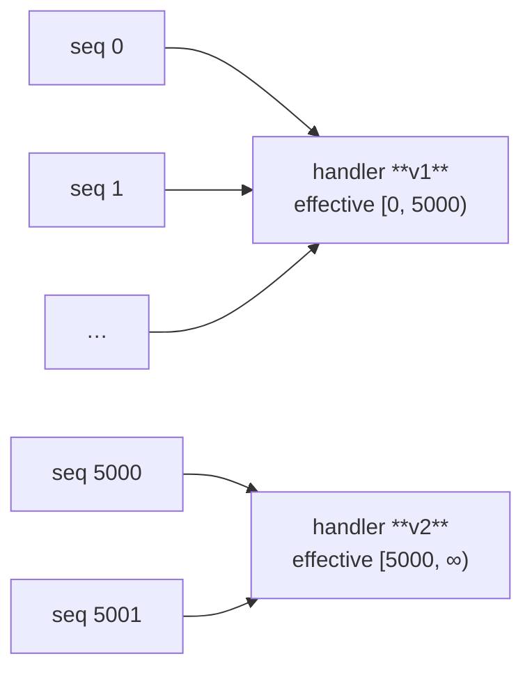

# Versioned Handlers

Versioned handlers let you replay a Rakaia stream and have *the handler
that was active when each event was originally written* run against that
event — not the current code. They make replay deterministic and
idempotent even when business logic has changed over time.

This page walks through the design and a realistic example based on
Partisipa's `Submission` import pipeline.

## The problem

Business logic that interprets events changes. A common workaround is to
write a one-off migration that iterates historical rows and re-saves them
so newer signals fire. Partisipa's `partisipa-import` repo carries this
pattern in `form_submission/post_migration_tasks.py` — entries like
`_task_sf12_backfill_project_ids` and `_task_ff4_backfill` exist precisely
because the only way to apply newer logic to old data is to re-trigger
save signals manually.

Versioned handlers replace that ad-hoc pattern with a first-class one:

- Every handler registers with a `[from_seq, to_seq)` range over the
  stream's sequence numbers.
- The replay orchestrator picks the version whose range covers each event.
- Handlers are **pure** — they return `Effect` descriptions, not direct DB
  writes. A separate executor applies the effects via `update_or_create`,
  so re-running replay converges instead of duplicating rows.
- Schema-shape changes are handled by **upcasters**, separately and
  composably.

## Concepts

New to these words? Each is defined in plain language in the
[glossary](glossary.md).

| Term            | Meaning                                                                                       |
|-----------------|-----------------------------------------------------------------------------------------------|
| **Handler**     | Pure function `event -> Effect | list[Effect]`. No I/O.                                       |
| **Version**     | One registered handler is one version. Multiple versions of the same handler-name are layered |
|                 | by sequence range; the dispatcher picks the one whose `[from, to)` covers the event's seq.    |
| **Effect**      | Frozen dataclass describing one database side-effect — `Upsert`, `Update`, `Delete` or `Retire`. |
| **Executor**    | Applies effects. `DjangoExecutor` runs `Model.objects.update_or_create()` in a transaction.   |
| **Upcaster**    | Pure function `dict -> dict` that bumps an event from schema version *N* to *N+1*.            |
| **Replay**      | Reads the stream, runs each event through the upcaster chain and resolved handlers, applies. |
| **Drift**       | The live source body of a handler/upcaster no longer matches the hash captured at registration. |

Key invariants:

- **Half-open intervals** `[from, to)`. `to=None` means "currently active."
- **Overlap rejected** at registration time. **Gaps raise** at replay time.
- **Multiple handlers** can fire on one event; they're independent and unordered.
- **Sibling effects** writing the same field on the same row raise
  `EffectCollisionError`.
- **External effects** (emails, third-party calls) are `ExternalEffect`s, not
  `Effect`s. No executor ever applies one; replay returns them in
  `ReplayResult.external` for the caller to route.

An event is dispatched to the handler version whose `[from, to)` range covers its
sequence number — so old events keep the logic that was correct at the time:



## Example: Partisipa SF_1_2 import

The Partisipa `Submission` model has a `key` (UUID), a `form_type`
discriminator (`"SF_1_2"`, `"TF_6_1_1"`, ...), and a `fields` JSON payload.
On save it should populate a typed row in `ida_forms.Sf_1_2`.

Two real changes from Partisipa's recent history are easy to express:

1. **Bug fix**: the original `cost_estimation` calculation didn't include
   tax. We fixed it in a later refactor — but only for events from that
   point onward, since older Submissions had already been processed with
   the wrong-but-recorded value.
2. **Schema rename**: the JSON field used to be `repeaterContribution`;
   newer submissions use `contributions`.

### `partisipa_import/handlers.py`

Django autodiscovery picks up this module on app `ready()`.

```python
from rakaia import Upsert
from rakaia import register_handler, register_upcaster


# ---------------------------------------------------------------------------
# Upcaster: rename `repeaterContribution` -> `contributions` (v1 -> v2)
# ---------------------------------------------------------------------------

@register_upcaster(event_match="submissions:SF_1_2", from_version=1)
def upcast_sf12_v1_to_v2(event: dict) -> dict:
    """Older SF_1_2 submissions used `repeaterContribution`. Normalise
    so handlers only ever see the new shape."""
    fields = event.get("fields", {})
    if "repeaterContribution" in fields:
        fields = {**fields, "contributions": fields.pop("repeaterContribution")}
    return {**event, "fields": fields}


# ---------------------------------------------------------------------------
# Handler v1: original cost_estimation (active for seq 0..4999)
# Bug: did not include tax. Stays in source so historical events still
# replay against the calculation that was correct at the time.
# ---------------------------------------------------------------------------

@register_handler(
    name="sf12_cost_sync",
    event_match="submissions:SF_1_2",
    effective_from=0,
    effective_to=5000,
)
def sf12_cost_sync_v1(event: dict) -> Upsert:
    contributions = event["fields"].get("contributions", [])
    cost = sum(c["amount"] for c in contributions)
    return Upsert(
        model_label="ida_forms.Sf_1_2",
        lookup={"submission_id": event["key"]},
        defaults={"cost_estimation": cost},
    )


# ---------------------------------------------------------------------------
# Handler v2: same intent, applies tax. Active from seq 5000 onward.
# ---------------------------------------------------------------------------

@register_handler(
    name="sf12_cost_sync",
    event_match="submissions:SF_1_2",
    effective_from=5000,
    effective_to=None,
)
def sf12_cost_sync_v2(event: dict) -> Upsert:
    contributions = event["fields"].get("contributions", [])
    subtotal = sum(c["amount"] for c in contributions)
    return Upsert(
        model_label="ida_forms.Sf_1_2",
        lookup={"submission_id": event["key"]},
        defaults={"cost_estimation": subtotal * 1.1},  # 10% tax
    )


# ---------------------------------------------------------------------------
# Sibling handler — sets project_status on VERIFIED submissions.
# Runs alongside sf12_cost_sync on every event. Writes a different
# `defaults` key, so no EffectCollisionError.
# ---------------------------------------------------------------------------

@register_handler(
    name="sf12_project_status",
    event_match="submissions:SF_1_2",
    effective_from=0,
    effective_to=None,
)
def sf12_project_status(event: dict) -> Upsert | None:
    if event.get("status") != "VERIFIED":
        return None
    return Upsert(
        model_label="ida_forms.Sf_1_2",
        lookup={"submission_id": event["key"]},
        defaults={"project_status": 1},
    )
```

### Producer side

Wherever Submissions are saved today, emit an event with a producer-declared
`schema_version`. The producer doesn't have to be at the latest version —
upcasters will normalise on read.

```python
import json
from rakaia import StreamStore   # or your durable store of choice

store: StreamStore = ...               # singleton

def emit_submission_event(submission):
    store.append(
        f"submissions:{submission.form_type}",
        json.dumps({
            "schema_version": 2,
            "key": str(submission.key),
            "form_type": submission.form_type,
            "status": submission.status,
            "fields": submission.fields,
        }).encode("utf-8"),
    )
```

### Running replay

The equivalent of running every `_task_*_backfill` together:

```bash
python manage.py replay submissions:SF_1_2 --from 0
# [APPLIED] stream='submissions:SF_1_2' events=12847 effects=24102 external=0
```

Options:

| Flag                  | Effect                                                                  |
|-----------------------|-------------------------------------------------------------------------|
| `--from N`            | First event index to replay (default 0).                                |
| `--to M`              | One past the last event index to replay (default: stream head).         |
| `--strict-drift`      | Raise `HandlerDriftError` on source-hash mismatch instead of warning.   |
| `--dry-run`           | Resolve handlers and count effects without applying them.               |

What this gets you:

1. **Idempotent**. Running replay twice produces identical DB state because
   `update_or_create` converges.
2. **Time-correct**. Events at seq 0–4999 run through `sf12_cost_sync_v1`
   (no tax); events from 5000 onward run through `v2`. The bugfix doesn't
   silently rewrite history.
3. **Composable schema changes**. The upcaster ensures handlers never see
   the legacy `repeaterContribution` field, even on the oldest events.

If you decide that *all* historical events should use v2's tax math after
all, you'd retire v1 and register a new version covering `[0, 5000)`:

```python
# (Hypothetical follow-up registration)
@register_handler(
    name="sf12_cost_sync",
    event_match="submissions:SF_1_2",
    effective_from=0,
    effective_to=5000,    # would overlap v1 — must retire v1 first
)
def sf12_cost_sync_v1b(event): ...
```

This is intentionally explicit: retroactive changes are first-class events
in the registry stream, not silent edits to frozen functions.

## Drift detection

A handler's source body is hashed at registration time and stored
alongside the version. On replay, the live hash is recomputed and
compared.

```bash
python manage.py replay submissions:SF_1_2 --from 0
# RAKAIA_DRIFT handler='sf12_cost_sync' stored=ab12cd34ef56 current=99887766ddee
# [APPLIED] stream='submissions:SF_1_2' events=12847 effects=24102 external=0
```

By default replay **warns and continues** — useful in development. CI or
pre-deploy checks can pass `--strict-drift` to fail loudly:

```bash
python manage.py replay submissions:SF_1_2 --strict-drift
# raises HandlerDriftError("handler='sf12_cost_sync' stored=... current=...")
```

The drift signal tells you that a function you'd promised to leave alone
(because old events were processed under it) has been edited. The
remedy is either to revert the change or to formalise it as a new
version covering the appropriate seq range.

Handlers, reducers and upcasters are all checked the same way, by the same code:
one `DriftLedger` per replay, which knows what has drifted, says so once however
long the stream is, and reads each function's source at most once. `upcast()` —
normalising one event on read, outside a replay — is silent by default because it
has nowhere to report to; hand it a ledger to ask the same question:

```python
from rakaia import DriftLedger, upcast

ledger = DriftLedger()                 # or DriftLedger(on_drift="raise")
event = upcast(raw, "submissions", drift=ledger)
if ledger.drifted:
    ...  # ledger.warnings holds the RAKAIA_DRIFT lines
```

### Upcasters rewrite history — and are *not* seq-versioned

Handlers are bracketed by a `[from_seq, to_seq)` range, so old events keep the
logic that was live when they were written. **Upcasters are not.** An upcaster is
keyed by `(event_match, from_version)` alone, so editing a shipped upcaster's body
retroactively changes the effective shape of **every** historical event at that
schema step — the next replay runs them all through the *new* code.

Drift detection **catches** this (the same `RAKAIA_DRIFT` warning, or a raise
under `--strict-drift`) but does not prevent it — a source-hash mismatch on an
upcaster means "you changed how all of history is interpreted," which is almost
never what you want once events exist at that version.

The contract, therefore:

> Once events exist at schema version *N*, treat the `from_version=N` upcaster's
> body as **append-only history**. Evolve the schema by adding a *new*
> `from_version=N` → `N+1` step (a longer chain), never by editing a shipped
> upcaster in place.

An in-place edit is only safe before any event has been written at that version
(e.g. still in development). After that, add a step.

## Registries: global vs injected, and test isolation

The bare decorators (`@register_handler`, `@register_upcaster`,
`@register_reducer`) register against **process-wide default registries** —
convenient for an app that discovers its handlers at import time. But a global
mutable registry is the seam most at odds with rakaia's otherwise pure design:
registrations made in one test leak into the next, and long-running / hot-reload
processes accumulate stale versions.

Two supported patterns keep replay deterministic and tests isolated:

**Preferred — construct and inject a fresh registry.** `replay()` and
`merge_replay()` take `handler_registry=` / `upcaster_registry=`, so a test (or a
per-tenant caller) can build its own and never touch the global:

```python
from rakaia import HandlerRegistry, UpcasterRegistry, replay

handlers = HandlerRegistry()
handlers.register("mogrify", "room:*", mogrify_v1, effective_from=0)
replay(store, "room:1", executor, handler_registry=handlers)
```

This is also how you get **namespace / tenant scoping** today: key a separate
registry instance per tenant and inject it — there is no built-in scoping on the
default registry, and this is the escape hatch.

**Default-registry tests — reset in teardown.** When the code under test uses the
bare decorators, call `reset_default_registries()` between tests:

```python
import pytest
from rakaia import reset_default_registries

@pytest.fixture(autouse=True)
def _isolate_registries():
    reset_default_registries()
    yield
    reset_default_registries()
```

rakaia's own `tests/test_rakaia/conftest.py` ships exactly this fixture.
`HandlerRegistry.reset()` / `UpcasterRegistry.reset()` clear **in-memory**
registration state only; they do **not** delete the durable meta-streams
(`__rakaia__:handlers`, `__rakaia__:upcasters`, `__rakaia__:reducers`). On a
store-backed registry, resetting the dedup cache means the next `register()`
re-appends an audit event even for an already-persisted registration — delete the
meta-stream via the store if you need a truly clean slate.

### Reducers replace last-write-wins

A **reducer** (`register_reducer(name, stage, fn)`) is a single *current*
definition keyed by `name` — not a seq-versioned series like a handler.
Registering a different function under an existing name **replaces** it. This is
deliberate: a reducer recomputes an aggregate *wholesale* from the committed
projections on every replay, so there is no per-sequence window to version over.
If you need two coexisting reduce steps, give them distinct names.

### Reducers: recompute everything, or just what changed

By default a reducer is called `fn(reader)` and recomputes its aggregate
*wholesale* — correct, and the right thing for a full rebuild. But recomputing
every group on every incremental save is wasteful when a single submission
touched two of them.

A reducer that declares a **second parameter** — `fn(reader, touched)` — is
handed the tuple of `TouchedSubject`s the pass's per-event handlers wrote (each
carries the effect's `model_label` and `lookup`). It is deterministic and
deduplicated, in event order, and — crucially — is a function of *this pass*:
on a full replay it is every subject; on a tail/incremental replay it is only
the ones the tail touched. So one reducer serves both paths — scope the
recompute (and the `reconcile_aggregate` scope) to `touched` when it is small,
recompute everything when it is the whole stream:

```python
from rakaia import register_reducer, reconcile_aggregate

@register_reducer(name="balance", stage=1)
def balance(reader, touched):
    sukus = {t.lookup["suku"] for t in touched if t.model_label == "ida.Line"}
    groups = _recompute_totals(reader, only=sukus)      # only the touched groups
    return reconcile_aggregate("ida.Balance", {}, "suku", groups)
```

The signal is opt-in and detected by signature (the same way a stage > 0 handler
opts in to the reader): a plain `fn(reader)` reducer is called exactly as before.
Note it reflects **handler** writes only — a reducer's own output Effects are not
recorded as touched, so reducers at the same stage don't feed each other.

## Replacing `post_migration_tasks.py`

Existing `PostMigrationTask` entries map naturally onto versioned handlers
plus a replay. Each task that calls `Submission.objects.filter(...).save()`
to re-trigger newer logic is, in the new model:

1. The new business logic is already in place as a handler version with
   the right `effective_from`.
2. A one-shot `python manage.py replay <stream> --from N` re-derives the
   downstream state.
3. Idempotency is guaranteed by the executor's `update_or_create`, so the
   replay can be re-run safely if it gets interrupted.

Concretely, `_task_sf12_backfill_project_ids` becomes:

- The corrected mapping logic registered as `sf12_project_id_sync` v2,
  covering the seq range from which migration 0096 took effect.
- `python manage.py replay submissions:SF_1_2 --from <seq>`.
- The `PostMigrationTaskStatus` row that recorded completion is replaced
  by the durable `__rakaia__:handlers` registration event itself.

Migration is incremental: tasks can be ported one at a time, with the new
and old systems coexisting until the last task is removed.

## See also

- [`docs/protocol.md`](protocol.md) — the underlying durable-streams protocol.
- [`docs/django-integration.md`](django-integration.md) — the `@stream_model`
  decorator and Django stream storage.
