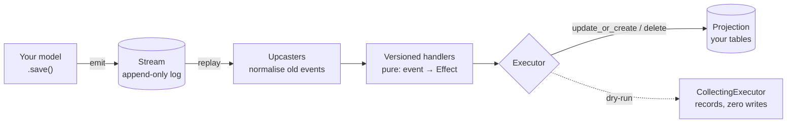
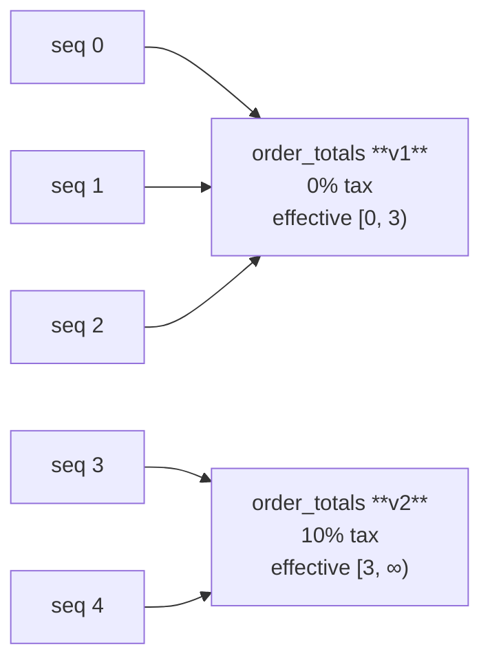
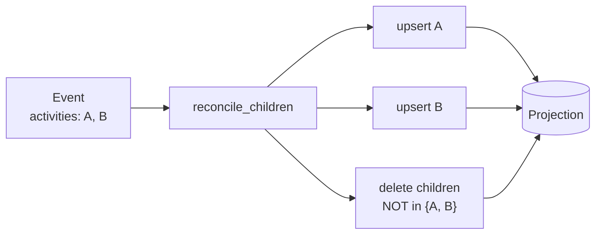
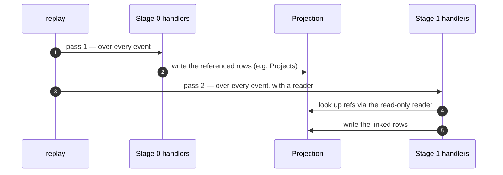
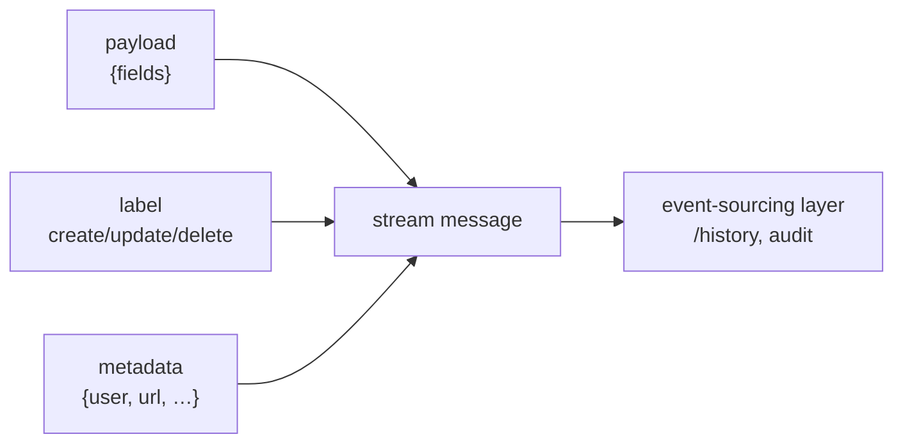
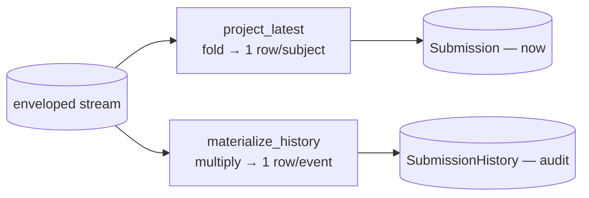
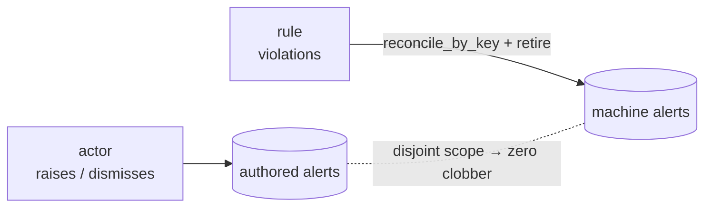

# What's new — a guided tour

New here and evaluating rakaia? This page is the fast path. It walks the
capabilities added most recently, each with the problem it solves, a small
snippet, and a **one-command demo you can run to prove it** — no setup beyond
`just install`.

Rakaia is a [Durable Streams protocol](protocol.md) server plus a Django
integration. On top of the raw stream it adds an **event-sourcing layer**: your
[projections](glossary.md#projection) (database rows) are *derived* from an
append-only [event log](glossary.md#stream) by pure,
[versioned handlers](glossary.md#versioned-handler), so you can
[replay](glossary.md#replay) history and get time-correct results instead of
whatever today's code would compute. The features below are what make that
practical to adopt. Linked terms above (and any that trip you up) are defined in
the [glossary](glossary.md).

The whole system is this one loop — every feature below is a refinement of a
piece of it (unfamiliar words are in the [glossary](glossary.md)):



## Run the whole tour at once

```bash
just install     # sync all dependency groups
just demo        # runs the scripted demos end-to-end, with narration
```

`just demo` runs the two headless demos below and then points you at the two live
SSE demos. To jump straight to one, use its command from the table.

| Example | Proves | Command |
|---|---|---|
| [`orders`](../examples/orders/) | Versioned handlers, upcasters, replay, dry-run | `just orders-demo` |
| [`formkit_submissions`](../examples/formkit_submissions/) | Projections/fan-out, `reconcile_children`, migration parity | `just formkit-demo` |
| [`formkit_submissions` (stream)](../examples/formkit_submissions/) | Arrow-flip: append log = source of truth → projection | `just formkit-stream-demo` |
| [`chat`](../examples/chat/) | `@stream_model`, multi-stream events, live SSE | `just dev` → http://localhost:8000 |
| [`polyglot`](../examples/polyglot/) | Language-scoped streams, live-editable translations | `just polyglot-dev` → http://localhost:8001 |

Going deeper? Several **design spikes** exercise the advanced replay features on
a real (Partisipa) form pipeline — staged replay (`just partisipa-demo`),
multi-stream merge (`just partisipa-merge-demo`), and nested-repeater
tree-reconcile (`just partisipa-tree-demo`). They're linked from the sections
below.

Two **zero-dependency demos** cover the layers underneath Django, with no
database at all: [`protocol_streams`](../examples/protocol_streams/) drives the
raw protocol — append/read, producer fencing, close, subscriber cursors
(`just protocol-demo`) — and [`multi_owner`](../examples/multi_owner/) drives the
effect primitives for a row with several writers — symbolic `Ref`s,
`reconcile_aggregate(owns=)`, `reconcile_by_key` (`just multi-owner-demo`).

---

## 1. Versioned handlers & replay

**The problem.** Business rules change. A tax rate, a completion threshold, a
mapping — the rule that was correct last quarter isn't the rule today. If your
projections are computed by *current* code, re-running it over old events
silently rewrites history.

**What rakaia does.** Handlers are registered against a **sequence range**, so an
old event runs through the handler version that was correct *when it happened*.
Fixing a rule forward never rewrites the past.

```python
from rakaia import Upsert, register_handler


@register_handler(
    name="order_totals", event_match="orders", effective_from=0, effective_to=3
)  # tax-free era
def order_totals_v1(event):
    return Upsert(
        model_label="orders.OrderSummary",
        lookup={"order_id": event["order_id"]},
        defaults={"tax": 0},
    )


@register_handler(
    name="order_totals", event_match="orders", effective_from=3
)  # 10% from seq 3 on
def order_totals_v2(event): ...
```

Each event flows to the handler version whose range covers its sequence number,
so the past keeps its old answer while new events get the new rule:



Replay is idempotent (`update_or_create`), so you can re-run it safely, and it
detects **drift** — a "frozen" historical handler whose source was edited after
old events already ran through it (`--strict-drift`).

→ Deep dive: [Versioned handlers](versioned-handlers.md) · Demo: `just orders-demo`

## 2. Upcasters — evolve event schemas

**The problem.** Producers rename fields (`qty` → `quantity`). You don't want
every handler to special-case old payloads forever.

**What rakaia does.** An [**upcaster**](glossary.md#upcaster) is a pure function
that migrates an event from one schema version to the next, applied on read
*before* handlers see it. Handlers only ever deal with the latest shape.

```python
from rakaia import register_upcaster


@register_upcaster(event_match="orders", from_version=1)
def rename_qty(event):
    return {**event, "quantity": event.pop("qty")}
```

→ Deep dive: [Versioned handlers — Concepts](versioned-handlers.md#concepts) · Demo: `just orders-demo`

## 3. Projections & fan-out without orphans

**The problem.** One event often projects into *many* rows (a form's repeater, an
order's line items). When a later event has fewer children, a naive
`update_or_create` fan-out leaves the dropped rows orphaned.

**What rakaia does.** [`reconcile_children`](glossary.md#reconcile) emits the
per-child upserts **and** a reconcile delete in one transaction, so the
projection always converges to exactly the children the event describes.

```python
from rakaia import reconcile_children


def activity_rows(event):
    return reconcile_children(
        model_label="app.ActivityProgress",
        parent_lookup={"submission_id": event["id"]},
        child_key="activity_index",  # each child keyed by its position
        items=event["activities"],
        defaults_fn=lambda a: {"progress": a["pct"]},
    )
```

One event, three writes — two upserts and a delete that sweeps whatever is no
longer in the list, so a resubmission with fewer children can't leave orphans:



For **unbounded nesting** (repeaters inside repeaters), `reconcile_tree` prunes
orphans anywhere in a submission's subtree; for **rollups**, `reconcile_aggregate`
materialises grouped summaries. Both are orphan-safe siblings of
`reconcile_children`.

→ Deep dive: [Projections & fan-out](projections-and-fan-out.md) ·
[Tree-reconcile](tree-reconcile.md) · Demos: `just formkit-demo`, `just partisipa-tree-demo`

## 4. Dry-run — and skip no-op writes

**The problem.** Two problems, really: (a) before a backfill you want to know
what a replay *will* write, and (b) re-materialising a large collection where one
row changed shouldn't rewrite *every* row — churning `auto_now` columns,
`post_save` signals, and replication.

**What rakaia does.** Handlers return effect *descriptions*, so a
`CollectingExecutor` records what a replay *would* do with zero side effects (the
dry-run count matches the real write count exactly). And `DjangoExecutor(skip_unchanged=True)`
compares each effect's `defaults` to the stored row and writes only what actually
changed.

```bash
python manage.py replay orders --dry-run     # preview, zero writes
```

→ Deep dive: [Dry-run & executors](dry-run-and-executors.md) · Shown in both demos

## 5. Staged replay — cross-form references

**The problem.** One form's projection often needs a *reference* another form
produced (a submission that links to a project created by a different form,
possibly arriving out of order). A single pass can't resolve a link whose target
hasn't been projected yet.

**What rakaia does.** Handlers declare a [`stage=`](glossary.md#stage-staged-replay);
replay runs stages in ascending order, and a later stage is handed a read-only
[projection reader](glossary.md#projection-reader) to resolve references built by
earlier stages — deterministic and self-healing, no backfills.

```python
@register_handler(name="sf12", event_match="SF_1_2", match_field="form_type", stage=1)
def sf12(event, refs):  # stage 1 gets a projection reader
    project = refs.get("ida.Project", suku=event["suku"], output=event["output"])
    return Upsert(
        model_label="ida_forms.Sf_1_2",
        lookup={"submission_id": event["key"]},
        defaults={"project_id": project.pk if project else None},
    )
```

Replay makes two passes; the second reads what the first built:



→ Deep dive: [Staged replay](staged-replay.md) ·
[Multi-stream merge](multi-stream-merge.md) · Demos: `just partisipa-demo`, `just partisipa-merge-demo`

## 6. A durable, database-backed store

**The problem.** The default in-memory store is process-local — great for a
demo, but the event log vanishes on restart, so you can't emit from a request
and replay later in another process.

**What rakaia does.** Set `RAKAIA_STORE = "durable"` and events persist in your
database via the normalized `Stream` / `StreamEvent` / `StreamEntry` models. Now
`manage.py replay <stream>` works across processes, unchanged.

→ Deep dive: [Adopting the durable store](django-integration.md#adopting-the-durable-store) · Used by `just formkit-demo`

## 7. Event envelope — who/when/how, not just what

**The problem.** A plain `append(new_state)` records *what* a row became but
throws away the three things an audit log needs: **who** changed it, **when**,
and **what kind** of change it was. A stream can't replace `django-pghistory`
until it carries that.

**What rakaia does.** Every event can carry an **envelope** alongside its
payload — a change **label** (create/update/delete → `+`/`~`/`-`) and an open
**metadata** dict (actor, url, causation). `provenance()` attaches the actor
*ambiently* for a whole request, so you don't thread it through every call; the
shipped middleware opens the block for you.

```python
from rakaia import provenance

with provenance(user=request.user.pk, url=request.path):
    obj.save()  # every append inside is attributed to this user
```



Related: `append_if_changed` records an event **only when something changed**
(comparing to the subject's current snapshot) — the write-side match for
pghistory's "record on change".

→ Deep dive: [The event envelope & provenance](event-envelope.md)

## 8. History read-model — two tables from one log

**The problem.** You want both "what is this row *now*" *and* "what *changed*,
when, and by whom" — a queryable audit trail — without a second write path.

**What rakaia does.** From one enveloped stream, derive two projections. A
**latest-state** projection *folds* the log (one row per subject); a **history**
read-model *multiplies* it (one immutable row per event, keyed by
`(subject, version)`) — the streams-native `/history` and the replacement for
`pgh_event`.



Because every snapshot stays in the audit log, recovering a subject's
most-complete historical snapshot — `repair_blank_save_dataloss`, stream edition
— is a scan over those rows.

→ Deep dive: [History read-model](history-read-model.md) · Demo: `just formkit-demo`

## 9. Alerts — human judgment and machine rules, without clobber

**The problem.** An alert can be raised by a *person* or by a failing *rule*, and
each is resolved differently. Re-running the rules (a replay) must never wipe out
a human's decision, and a human's dismissal must not be silently re-raised while
the rule still fails.

**What rakaia does.** Each layer gets a different owner and a scope that keeps
them disjoint: authored alerts are plain `update_or_create`; machine alerts use
`reconcile_by_key(..., retire=…)` scoped by a `retire_filter` so a re-derivation
**cannot** touch authored rows; dismissable warnings compose the two via
[staged replay](staged-replay.md) (stage 1 reads stage 0's dismissals).



→ Deep dive: [Alerts as a rakaia projection](alerts-projection.md)

## 10. Live SSE with `@stream_model`

**The problem.** You want real-time fan-out to browsers without hand-rolling a
pub/sub layer.

**What rakaia does.** Decorate a Django model; every save/delete emits a stream
event, broadcast to connected clients over Server-Sent Events via Channels.

```python
@stream_model(
    stream_paths=lambda o: f"room:{o.id}:messages",
    to_dataclass=lambda o: RoomData(id=o.id, name=o.name),
)
class ChatRoom(models.Model):
    name = models.CharField(max_length=100)
```

→ Deep dive: [Django integration](django-integration.md) · Demos: `just dev`, `just polyglot-dev`

## 11. Proof that a proof means something

A migration is signed off on a verification sweep: replay the log, collect what
it *would* write, diff that against the rows you already have. Two ways that
answer can be worthless, both now guarded — see them in
`just cookbook-demo`, checks **[3]** and **[4]**.

**A sweep that compared nothing must not report success.** `report.ok` asks "did
anything disagree?", which is vacuously true on an empty population — and the
ways a sweep silently examines zero rows are all mundane: a store on the wrong
backend, a replay over a renamed stream path, a filter that stopped matching, a
registry that failed to autodiscover. Read `verdict` instead, which separates
`GREEN` from `VACUOUS`, or `certified`, which is the assertion a proof wants:

```python
report = diff_effects_against_rows(ex.effects)
assert report.certified, report  # not `report.ok` — see above
report.raise_if_diff()  # raises VacuousVerification on an empty run
```

Failures are checked *before* vacuity, so a real failure is never hidden behind
"empty".

**A dry run must actually be dry.** `assert_no_live_writes` compares the live
row counts across a block and raises if anything moved — so "this replay wrote
nothing" becomes something you assert rather than something you trust:

```python
with assert_no_live_writes(Project, Task):
    replay(store, STREAM, CollectingExecutor(), reader=DjangoProjectionReader())
```

It is the write-side half of the rebuild gate; `deny_database_access` is the
read-side half, and the two compose in either nesting order.

---

## 12. One envelope, written once

Recording an event with its label, actor and timestamp is four lines — encode
the payload with Django's encoder, create the stream if it is missing, wrap the
rest in an `AppendOptions`. Written at every call site, and every copy that
drifted produced events that replay differently from their neighbours, with
nothing looking at the difference. `append_event` is those four lines:

```python
from django_rakaia import append_event

append_event(store, "submissions", payload, label="create", actor=user_id)
```

`examples/formkit_submissions` uses it for every append it makes, and its
`/history` check still recovers the right actor for each — which is the point:
adopting it is a deletion, not a rewrite.

Its sibling `fold_events` runs a batch of events through your handlers *now*,
via a throwaway in-memory stream, so write-time projection and rebuild-time
projection run the same code rather than two implementations that can disagree.

Underneath both is `rakaia.seed_stream`, which is the same idea one tier down:
getting a handful of events into a stream, without Django in the picture.

```python
from rakaia import AppendOptions, seed_stream

store = seed_stream(
    "submissions",
    [
        ({"key": "s1", "a": 1}, AppendOptions(label="insert")),
        ({"key": "s1", "a": 2}, AppendOptions(label="update")),
    ],
)
```

Omit `store=` and you get a fresh in-memory one back; pass any `WritableStore`
— the durable Django store, the `get_store()` singleton — and it is used and
returned. Payloads may be dicts or already-encoded bytes, the envelope is per
event rather than per batch, and the stream is created idempotently, so seeding
the same path twice appends rather than truncating.

The `encoder=` parameter is why `append_event` can be built on it without the
core package growing a Django dependency, and it is what keeps a single
`json.dumps` rule in the codebase instead of the drifting second copy the
envelope docstring warns about.

---

## 13. Protocol conformance

Rakaia is checked against the upstream, language-agnostic
[`@durable-streams/server-conformance-tests`](https://github.com/durable-streams/durable-streams)
suite in CI. It passes the full protocol surface today except the stream
**forking** family (not yet implemented). Run it yourself with `just conformance`
(needs node/npm); details in
[`conformance/README.md`](https://github.com/joshbrooks/rakaia/blob/main/conformance/README.md).

---

## 14. A rebuild that checks its own work

**The problem.** "Can this log rebuild my tables, and do the rows match?" is the
question that decides whether event sourcing is actually working for you. Asking
it by hand meant composing six interfaces in the right order — move the log off
the database being guarded, arm the write guard outside and the read guard
inside, record effects while still applying them, replay, build a reader, diff —
and then remembering the part written down nowhere: *a pass means nothing unless
the guards were actually armed*. A green result with the guard unwired looks
exactly like a green result.

**What rakaia does.** `rebuild_and_verify()` does the composition and checks its
own work. It trips the read guard on purpose and raises `GuardNotArmed` if
nothing happens, so a clean verdict cannot be obtained with the guard off.

```python
from django_rakaia import rebuild_and_verify

from forms.models import Submission

report = rebuild_and_verify(
    "submissions",
    into="scratch",  # a disposable database alias
    live_models=[Submission],  # required, not defaulted
)
print(report.verdict)  # GREEN, or VACUOUS when nothing was actually compared
```

`live_models` is required rather than defaulted to empty, because defaulting it
would disarm the write guard without saying so. It also refuses a from-scratch
claim it cannot honour, raising `ScratchAliasNotEmpty` when the disposable alias
still holds rows from an earlier run.

Read `verdict`, not `ok`. `ok` answers "did anything disagree?", which is
vacuously true when nothing was compared — an empty effect list from a store on
the wrong backend or a stream path that was renamed prints a clean bill of health
with nothing behind it. `verdict` separates `GREEN` from `VACUOUS`, and
`raise_if_diff()` refuses to certify a zero population.

→ Deep dive: [Dry-run & executors](dry-run-and-executors.md) · Demo: `just cookbook-demo`

## 15. `DriftLedger` — one object that knows whether a rule changed

**The problem.** Warning that the code behind a stored handler, reducer or
upcaster has been edited since it was registered used to be three near-identical
checks. The entry point into the third took two options that had to agree: pass
the report callback without the hash memo and every event re-read the source;
pass the memo without the callback and the check was skipped in silence.

**What rakaia does.** One object owns all three questions — has this rule
drifted, have I already said so, what have I hashed — so there is one check
reached three ways and one option to pass.

`ReplayResult.warnings` and `.drift_detected` read the same as before, but they
are now views onto `ReplayResult.drift` rather than lists of their own, so the
result and the log cannot disagree. Constructing a `ReplayResult` with
`warnings=` or `drift_detected=` is no longer accepted — pass
`drift=DriftLedger(...)`. `upcast()`, which normalises one event on read outside
a replay, takes a `drift=` ledger too and is silent without one.

→ Deep dive: [Versioned handlers](versioned-handlers.md) · Demo: `just orders-demo`

## 16. A replay applies a whole pass at once

**The problem.** A replay applied effects one event at a time, so rebuilding a
projection over a large log issued one statement per event per table, most of
them identical in shape.

**What rakaia does.** A replay now hands the executor a whole stage's changes at
once, and `DjangoExecutor(batch_updates=True)` collapses a fanned-out `Update`
into a single statement where it is provably safe to do so.

**Off by default.** The rows come out the same either way, and that is checked by
running the same effects down both paths and comparing every column. But the rule
deciding what may collapse was wrong four times during development, and each time
it wrote wrong data rather than raising — so a consumer opts in knowingly, and a
suspected write anomaly stays bisectable against the flag. Anything the rule
cannot prove safe (an `F()` expression, a composite lookup, a `NULL` match, a
`Decimal`, a date) is applied one statement at a time exactly as before.
Declining costs a statement, never a wrong row.

→ Deep dive: [Dry-run & executors](dry-run-and-executors.md)

## 17. Streams in plain files — no database, no broker

**The problem.** The in-memory store loses the log on restart, and the durable
one needs a database. Between them there was nothing for a consumer who wants the
log to survive a restart without running Postgres for it.

**What rakaia does.** `JsonlStreamStore` keeps a stream as a directory of
JSON-lines segments — one line per event, nothing involved but the filesystem.

```python
# settings.py
RAKAIA_STORE = "jsonl"
RAKAIA_JSONL_ROOT = BASE_DIR / "streams"
RAKAIA_JSONL_FSYNC = True  # off trades durability for speed
```

It holds the same store contract the other two do, including concurrent appends
from several processes and `wait_for_messages`, which it implements by watching
the directory. That last part is what makes **live updates work across processes
with no broker at all** — the `polyglot` example now runs four workers off one
log, serving SSE from rakaia's own protocol server, with no Redis between them.

**Changing `RAKAIA_STORE` does not move your log.** Restarting against a
different backend brings the app up on an empty one while every saved consumer
position is still syntactically valid, so consumers resume into silence rather
than failing loudly. Moving a log is a copy, and there is a call for it:

```python
from rakaia import migrate_stream

result = migrate_stream(source_store, target_store, "submissions")
print(result.offsets_preserved, result.head_preserved, result.notes)
```

`migrate_all` does the same for every stream the source can list.

→ Deep dive: [Store streams in files](store-streams-in-files.md) ·
[ADR 0006](adr/0006-changing-backends-is-a-copy.md) ·
Demo: `just polyglot-dev` → http://localhost:8001

## 18. Importing the framework no longer starts a server

**The problem.** `import rakaia` pulled in all ten protocol-server modules, and
`app = create_app()` at module scope built an in-memory store in every process
that imported the package — whether it ever served a request or not. Measured at
80 ms and one unwanted store, against 37 ms for the framework alone.

**What rakaia does.** Names resolve on first use. A framework consumer loads no
server module at all and pays 3 ms; a server consumer loads the seven it needs.
`uvicorn rakaia:app` still gets one object, built under a lock so concurrent
first access cannot produce several stores.

Nothing changes at your call sites — every public name still imports from
`rakaia` exactly as before. This is also what settled the long-open question of
whether to split the two halves into separate distributions: the last argument
for splitting was that importing one dragged in the other, and that is now fixed,
so the halves stay in one package.

→ Deep dive: [Framework vs. protocol server](framework-vs-protocol-server.md) ·
[ADR 0002](adr/0002-framework-vs-protocol-server-boundary.md)

---

## Where to go next

- Want the reference for handlers, upcasters and drift? → [Versioned handlers](versioned-handlers.md)
- Adopting rakaia over an existing signal-based pipeline? → the
  [`formkit_submissions`](../examples/formkit_submissions/) spike proves a
  parity migration end-to-end.
- Deploying? → [Deployment](deployment.md).
