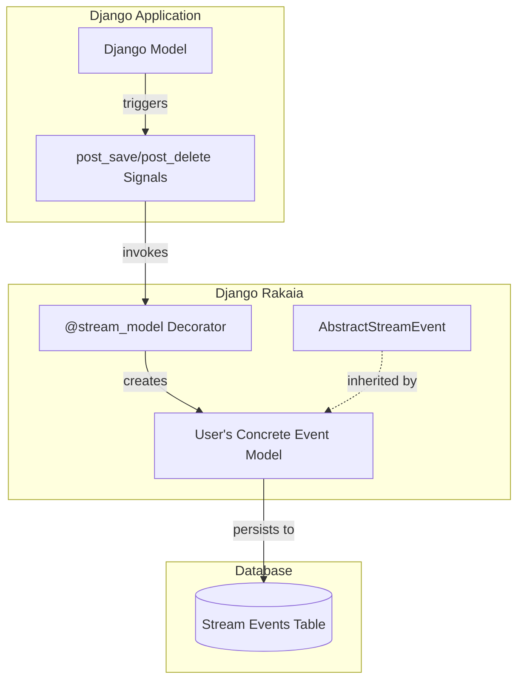
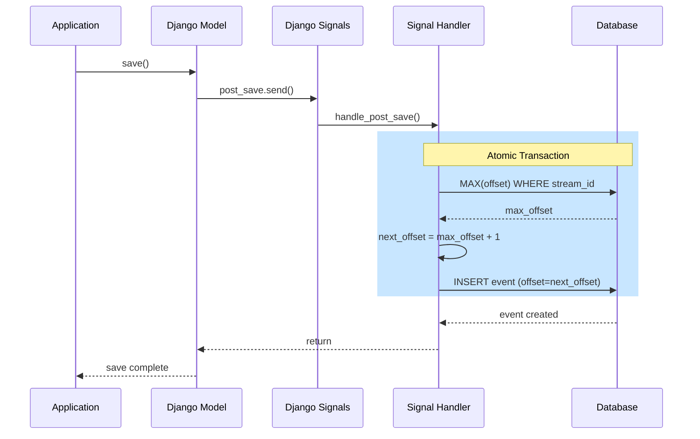
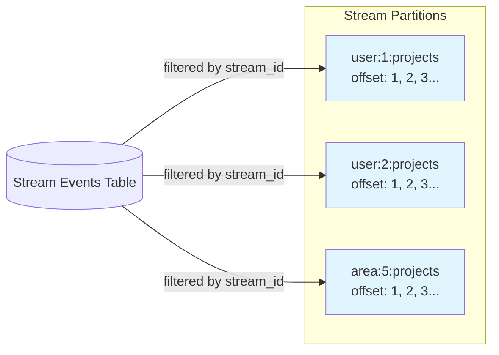

# Django Rakaia Integration

**Django Rakaia** provides seamless integration between Django models and the [Durable Streams protocol](../PROTOCOL.md). Automatically stream model changes (create, update, delete) to durable event tables with monotonic offsets.

## Installation

```bash
pip install rakaia[django]
```

Add `django_rakaia` to your `INSTALLED_APPS`:

```python
# settings.py
INSTALLED_APPS = [
    # ...
    "django_rakaia",
]
```

## Quick Start

### 1. Create Your Stream Event Model

Subclass `AbstractStreamEvent` to create a concrete event table for your application:

```python
# myapp/models.py
from django.db import models
from django_rakaia.models import AbstractStreamEvent


class AppStreamEvent(AbstractStreamEvent):
    """Concrete stream event model for this application."""

    class Meta(AbstractStreamEvent.Meta):
        app_label = "myapp"
```

Run migrations:

```bash
python manage.py makemigrations
python manage.py migrate
```

### 2. Define Dataclasses for Your Models

Create dataclasses that represent the data you want to stream:

```python
# myapp/models.py
from dataclasses import dataclass


@dataclass
class UserData:
    id: int
    username: str
    email: str


@dataclass
class ProjectData:
    id: int
    name: str
    status: str
```

### 3. Stream Your Models

#### For Custom Models: Use the `@stream_model` Decorator

```python
# myapp/models.py
from django.db import models
from django_rakaia.decorators import stream_model

from .models import AppStreamEvent, ProjectData


@stream_model(
    event_model=AppStreamEvent,
    stream_path=lambda obj: f"project:{obj.id}:updates",
    to_dataclass=lambda obj: ProjectData(
        id=obj.id,
        name=obj.name,
        status=obj.status,
    ),
)
class Project(models.Model):
    name = models.CharField(max_length=200)
    status = models.CharField(max_length=50, default="active")
```

#### For Built-in Models (like `User`): Use Signal Handlers

You cannot decorate built-in Django models (they're already defined). Instead, use `create_stream_event` in signal handlers:

```python
# myapp/models.py
from dataclasses import dataclass
from django.contrib.auth import get_user_model
from django.db.models.signals import post_save, post_delete
from django.dispatch import receiver

from django_rakaia.decorators import create_stream_event
from django_rakaia.models import AbstractStreamEvent


class AppStreamEvent(AbstractStreamEvent):
    class Meta(AbstractStreamEvent.Meta):
        app_label = "myapp"


@dataclass
class UserData:
    id: int
    username: str


User = get_user_model()


@receiver(post_save, sender=User)
def handle_user_save(sender, instance, created, **kwargs):
    create_stream_event(
        event_model=AppStreamEvent,
        stream_path=f"user:{instance.id}:activity",
        to_dataclass=lambda u: UserData(id=u.id, username=u.username),
        instance=instance,
        action="create" if created else "update",
    )


@receiver(post_delete, sender=User)
def handle_user_delete(sender, instance, **kwargs):
    create_stream_event(
        event_model=AppStreamEvent,
        stream_path=f"user:{instance.id}:activity",
        to_dataclass=lambda u: UserData(id=u.id, username=u.username),
        instance=instance,
        action="delete",
    )
```

## Architecture

### Component Overview



### Event Flow



### Stream Partitioning



## Usage Patterns

### Pattern 1: User Activity Streaming

Stream all changes to user-related data:

```python
from dataclasses import dataclass
from django.contrib.auth import get_user_model
from django.db.models.signals import post_save, post_delete
from django.dispatch import receiver

from django_rakaia.models import AbstractStreamEvent


@dataclass
class UserActivityData:
    user_id: int
    username: str
    action: str
    timestamp: str


class ActivityStreamEvent(AbstractStreamEvent):
    class Meta(AbstractStreamEvent.Meta):
        app_label = "activity"


User = get_user_model()


@receiver(post_save, sender=User)
def stream_user_activity(sender, instance, created, **kwargs):
    from django_rakaia.decorators import _get_next_offset
    from django.db import transaction
    
    action = "user_registered" if created else "profile_updated"
    payload = UserActivityData(
        user_id=instance.id,
        username=instance.username,
        action=action,
        timestamp=instance.last_login.isoformat() if instance.last_login else "",
    )
    
    with transaction.atomic():
        next_offset = _get_next_offset(ActivityStreamEvent, f"user:{instance.id}:activity")
        ActivityStreamEvent.objects.create(
            stream_id=f"user:{instance.id}:activity",
            data=dataclasses.asdict(payload),
            event_type=action,
            offset=next_offset,
        )
```

### Pattern 2: Area/Project Subscription

Stream project updates to all subscribers of an area:

```python
from dataclasses import dataclass

from django.db import models
from django_rakaia.decorators import stream_model
from django_rakaia.models import AbstractStreamEvent


@dataclass
class ProjectUpdateData:
    project_id: int
    name: str
    area_id: int
    updated_fields: list[str]


class ProjectStreamEvent(AbstractStreamEvent):
    class Meta(AbstractStreamEvent.Meta):
        app_label = "projects"


@stream_model(
    event_model=ProjectStreamEvent,
    stream_path=lambda obj: f"area:{obj.area_id}:projects",
    to_dataclass=lambda obj: ProjectUpdateData(
        project_id=obj.id,
        name=obj.name,
        area_id=obj.area_id,
        updated_fields=["name"],  # Customize as needed
    ),
)
class Project(models.Model):
    name = models.CharField(max_length=200)
    area = models.ForeignKey("Area", on_delete=models.CASCADE)
```

### Pattern 3: Multi-Stream Broadcasting

Stream the same event to multiple streams:

```python
# Note: This requires custom signal handling
from django.db.models.signals import post_save
from django.dispatch import receiver


@receiver(post_save, sender=Project)
def broadcast_project_update(sender, instance, created, **kwargs):
    streams = [
        f"project:{instance.id}:updates",
        f"area:{instance.area_id}:updates",
        f"global:projects:recent",
    ]
    
    for stream_path in streams:
        create_event_for_stream(
            stream_id=stream_path,
            instance=instance,
            action="create" if created else "update",
        )
```

## API Reference

### `AbstractStreamEvent`

Abstract base model for stream events.

| Field | Type | Description |
|-------|------|-------------|
| `stream_id` | `CharField(255)` | Stream identifier (e.g., `"user:123:projects"`) |
| `data` | `JSONField` | Event payload |
| `event_type` | `CharField(50)` | Event type: `"create"`, `"update"`, or `"delete"` |
| `created_at` | `DateTimeField` | Automatic timestamp |
| `offset` | `BigIntegerField` | Monotonic offset within the stream |

### `@stream_model` Decorator

```python
def stream_model(
    event_model: type[models.Model],
    stream_path: str | Callable[[models.Model], str],
    to_dataclass: Callable[[models.Model], Any],
) -> Callable[[type[models.Model]], type[models.Model]]:
    """
    Decorator to stream Django model changes.
    
    Args:
        event_model: Concrete subclass of AbstractStreamEvent.
        stream_path: Stream ID string or callable returning stream ID.
        to_dataclass: Callable converting model instance to dataclass.
    """
```

### Helper Functions

```python
def _get_next_offset(event_model: type[models.Model], stream_id: str) -> int:
    """Calculate the next monotonic offset for a stream."""
```

## Reading Stream Events

Query events for a specific stream:

```python
# Get all events for a stream in order
events = AppStreamEvent.objects.filter(
    stream_id="area:5:projects"
).order_by("offset")

# Get events after a specific offset (for catch-up reads)
last_offset = 100
new_events = AppStreamEvent.objects.filter(
    stream_id="area:5:projects",
    offset__gt=last_offset
).order_by("offset")

# Get the latest N events
recent_events = AppStreamEvent.objects.filter(
    stream_id="area:5:projects"
).order_by("-offset")[:10]
```

## Best Practices

### 1. Keep Event Data Minimal

Only include fields that subscribers need:

```python
# ✅ Good: Minimal data
@dataclass
class ProjectSummary:
    id: int
    name: str
    status: str


# ❌ Avoid: Too much data
@dataclass
class ProjectFull:
    id: int
    name: str
    description: str  # Large text field
    metadata: dict    # Entire JSON blob
    history: list     # Entire history array
```

### 2. Use Meaningful Stream IDs

Design stream IDs that support your query patterns:

```python
# ✅ Good: Hierarchical and queryable
f"user:{user_id}:projects"
f"area:{area_id}:projects"
f"org:{org_id}:users:{user_id}:activity"

# ❌ Avoid: Opaque IDs
f"stream_{uuid.uuid4()}"
```

### 3. Handle Migrations Carefully

When adding streaming to existing models:

```python
# 1. Create the event model first
# 2. Run migrations
# 3. Add the decorator
# 4. Optionally backfill historical events
```

### 4. Consider Event Versioning

Include a version field in your dataclasses for schema evolution:

```python
@dataclass
class UserDataV1:
    version: int = 1
    id: int
    username: str
```

---

## Architecture Evaluation: SOLID & DRY Principles

### SOLID Analysis

#### ✅ Single Responsibility Principle (SRP)

Each component has a single responsibility:

| Component | Responsibility |
|-----------|----------------|
| `AbstractStreamEvent` | Defines the event schema |
| `stream_model` decorator | Connects signals to event creation |
| `_get_next_offset` | Calculates monotonic offsets |
| User's dataclass | Defines event payload structure |

**Status:** **Compliant** - Each class/function has one reason to change.

#### ✅ Open/Closed Principle (OCP)

The system is open for extension, closed for modification:

- **Extension:** Users subclass `AbstractStreamEvent` and apply `@stream_model` to new models
- **No Modification:** Core code doesn't need changes for new use cases

**Status:** **Compliant** - New models can be streamed without modifying the library.

#### ⚠️ Liskov Substitution Principle (LSP)

`AbstractStreamEvent` is designed for subclassing, but users could violate LSP by:

```python
# ❌ Potential LSP violation
class BadStreamEvent(AbstractStreamEvent):
    # Removing required fields would break the decorator
    stream_id = None  # This would cause errors
```

**Status:** **Mostly Compliant** - The abstract model enforces the contract, but Python's dynamic nature means users could misuse it.

**Recommendation:** Add runtime validation in the decorator:

```python
def stream_model(event_model, stream_path, to_dataclass):
    # Validate event_model has required fields
    required_fields = ["stream_id", "data", "event_type", "offset"]
    for field_name in required_fields:
        if not hasattr(event_model, field_name):
            raise ValueError(f"Event model must have '{field_name}' field")
```

#### ✅ Interface Segregation Principle (ISP)

The decorator accepts simple, focused callables:

```python
StreamPathResolver = str | Callable[[models.Model], str]
DataclassTransformer = Callable[[models.Model], Any]
```

Users only implement what they need.

**Status:** **Compliant** - No forced dependencies on unused interfaces.

#### ✅ Dependency Inversion Principle (DIP)

High-level modules (decorator) don't depend on low-level details:

- The decorator depends on the abstract `models.Model`, not concrete implementations
- Users provide their concrete `event_model` at decoration time

**Status:** **Compliant** - Dependencies are inverted through the decorator pattern.

### DRY Analysis

#### ✅ No Duplication in Core Logic

- Offset calculation is centralized in `_get_next_offset`
- Event creation logic is in `_create_event`
- Signal handling is unified in the decorator

#### ⚠️ Potential Duplication in User Code

Users handling built-in models (like `User`) must duplicate signal handler logic:

```python
# Current: Duplication required for built-in models
@receiver(post_save, sender=User)
def user_handler(sender, instance, created, **kwargs):
    # Duplicated logic from decorator
    with transaction.atomic():
        next_offset = _get_next_offset(...)
        AppStreamEvent.objects.create(...)

# For custom models: No duplication
@stream_model(...)
class Project(models.Model):
    pass
```

**Recommendation:** Extract a public helper function:

```python
# django_rakaia/decorators.py
def create_stream_event(
    event_model: type[models.Model],
    stream_path: str,
    to_dataclass: Callable[[models.Model], Any],
    instance: models.Model,
    action: str,
) -> None:
    """Create a stream event for the given model instance."""
    # Implementation here
```

Then users can write:

```python
from django_rakaia import create_stream_event

@receiver(post_save, sender=User)
def user_handler(sender, instance, created, **kwargs):
    create_stream_event(
        event_model=AppStreamEvent,
        stream_path=f"user:{instance.id}:activity",
        to_dataclass=to_user_data,
        instance=instance,
        action="create" if created else "update",
    )
```

### Summary & Recommendations

| Principle | Status | Notes |
|-----------|--------|-------|
| **SRP** | ✅ Compliant | Clean separation of concerns |
| **OCP** | ✅ Compliant | Easy to extend without modification |
| **LSP** | ⚠️ Mostly | Add runtime validation for field presence |
| **ISP** | ✅ Compliant | Focused, minimal interfaces |
| **DIP** | ✅ Compliant | Depends on abstractions |
| **DRY** | ⚠️ Mostly | Extract public `create_stream_event` helper |

### Recommended Improvements

1. **Add `create_stream_event` public API** to reduce duplication for built-in models
2. **Add runtime validation** to ensure event models have required fields
3. **Document stream ID design patterns** more extensively
4. **Consider adding stream queries helper** for common read patterns:

```python
from django_rakaia import get_stream_events

events = get_stream_events(
    event_model=AppStreamEvent,
    stream_id="area:5:projects",
    after_offset=100,
    limit=50,
)
```

---

## Django Admin Integration

### Register Your Stream Event Model

Use `register_stream_event_admin` to add your stream event model to the Django admin:

```python
# myapp/models.py
from django_rakaia.admin import register_stream_event_admin

class AppStreamEvent(AbstractStreamEvent):
    class Meta(AbstractStreamEvent.Meta):
        app_label = "myapp"

# Register with admin
register_stream_event_admin(AppStreamEvent)
```

### Admin Features

- **Colored event type badges** (green=create, yellow=update, red=delete)
- **JSON data preview** with syntax highlighting
- **Filtering** by event type, date, and stream ID
- **Search** across stream IDs and event data
- **Pagination** for large event tables

---

## Data Streams Dashboard

Django Rakaia includes a web dashboard for monitoring streams in real-time.

### Setup

1. **Include URLs** in your project's `urls.py`:

```python
# urls.py
from django.urls import path, include

urlpatterns = [
    path("admin/", admin.site.urls),
    path("streams/", include("django_rakaia.urls", namespace="django_rakaia")),
]
```

2. **Access the dashboard** at `/streams/`

### Dashboard Features

#### Streams Index (`/streams/`)

- **Statistics cards**: Active streams, total events, most common event type
- **Event type breakdown**: Visual bar chart of create/update/delete distribution
- **Active streams table**: Stream ID, event count, offset range, last activity
- **Recent events**: Last 10 events across all streams

#### Stream Detail (`/streams/<stream_id>/`)

- **Live updates**: Server-Sent Events (SSE) push new events in real-time
- **Event timeline**: Chronological table of all events in the stream
- **Expandable JSON**: Click to view full event data
- **Connection status**: Visual indicator of SSE connection state
- **Load more**: Pagination for historical events

#### API Endpoints

| Endpoint | Description |
|----------|-------------|
| `GET /streams/` | Dashboard index page |
| `GET /streams/<stream_id>/` | Stream detail page with live updates |
| `GET /streams/api/streams/` | JSON API: list all streams |
| `GET /streams/api/streams/<stream_id>/` | JSON API: get events for a stream |
| `GET /streams/api/streams/<stream_id>/sse/` | SSE endpoint for real-time updates |

### Real-Time Updates

The stream detail page uses **Server-Sent Events (SSE)** to push new events as they occur:

```javascript
// Browser automatically connects to SSE endpoint
const eventSource = new EventSource('/streams/api/streams/area:5:projects/sse/');

eventSource.onmessage = (event) => {
    const data = JSON.parse(event.data);
    // New event received - add to table
    addEventToTable(data.event);
};
```

**Features:**
- ✅ Automatic reconnection on disconnect
- ✅ Visual connection status indicator
- ✅ Highlight animation for new events
- ✅ Auto-scroll to new events
